# 아키텍처 (ARCHITECTURE)

> 기준일 2026-10-08, 작성 차수 S01. 이후 차수는 이 문서의 상태 이름·시간 예산·모듈 경계를 그대로 쓴다. 바꿀 때는 ADR을 남기고 이 문서를 같은 커밋에서 고친다.
> 근거: [BUSINESS_CONTEXT](BUSINESS_CONTEXT.md) · 위협: [THREAT_MODEL](THREAT_MODEL.md) · 범위: [MVP](MVP.md) · 용어: [GLOSSARY](GLOSSARY.md) · 미지수: [KNOWN_UNKNOWNS](KNOWN_UNKNOWNS.md) · 결정: [docs/adr/](adr/0001-record-decisions.md)
> 측정 전인 값은 모두 '목표' 또는 '기본값'이다. 실측으로 바뀌면 이 문서를 고친다(절대 규칙 8).

## 0. 한눈에 보기
- 서버(coordinator) 1개 프로세스가 구매자 API, 에이전트 WebSocket 관문, 스케줄러, 원장을 모두 가진다(v0.1). 상태는 Postgres 하나에 있다(ADR 0002).
- PC방 PC의 에이전트는 Windows 서비스(세션 0) + 사용자 세션 헬퍼로 나뉘고(ADR 0011), 추론은 서명된 llama.cpp 프로세스가 한다(ADR 0004). 손님 입력이 보이면 서버를 기다리지 않고 로컬에서 즉시 죽인다(ADR 0016).
- 돈은 정수 최소 단위 + 이중기입 원장으로만 움직인다(ADR 0005). 매장 몫은 72시간 성숙 뒤 확정되고, 검증(ADR 0007)에서 부정이 나오면 회수한다.
- 이 문서가 명세(차수 문서)와 다르게 정한 것은 [12절 이견](#12-이견-명세와-다르게-설계한-것)에 모았다. 해당 차수는 그 절을 먼저 읽는다.

## 1. 시스템 맥락도

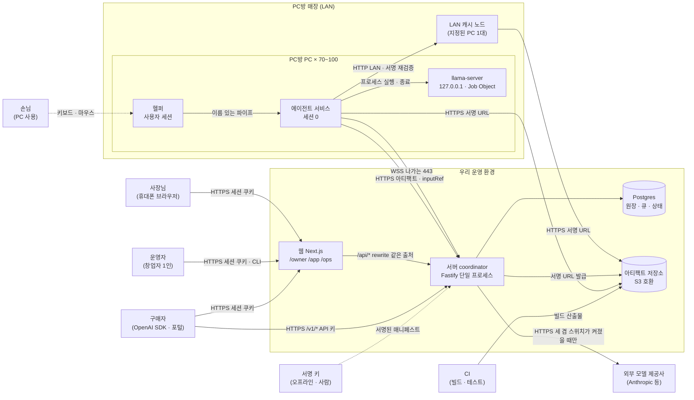
```mermaid
flowchart LR
  owner["사장님<br/>(휴대폰 브라우저)"]
  buyer["구매자<br/>(OpenAI SDK · 포털)"]
  operator["운영자<br/>(창업자 1인)"]
  guest["손님<br/>(PC 사용)"]
  subgraph store["PC방 매장 (LAN)"]
    subgraph pc["PC방 PC × 70~100"]
      helper["헬퍼<br/>사용자 세션"]
      agent["에이전트 서비스<br/>세션 0"]
      runtime["llama-server<br/>127.0.0.1 · Job Object"]
    end
    cache["LAN 캐시 노드<br/>(지정된 PC 1대)"]
  end
  subgraph cloud["우리 운영 환경"]
    web["웹 Next.js<br/>/owner /app /ops"]
    server["서버 coordinator<br/>Fastify 단일 프로세스"]
    db[("Postgres<br/>원장 · 큐 · 상태")]
    blob[("아티팩트 저장소<br/>S3 호환")]
  end
  provider["외부 모델 제공사<br/>(Anthropic 등)"]
  signer["서명 키<br/>(오프라인 · 사람)"]
  ci["CI<br/>(빌드 · 테스트)"]

  owner -->|HTTPS 세션 쿠키| web
  operator -->|HTTPS 세션 쿠키 · CLI| web
  buyer -->|HTTPS 세션 쿠키| web
  web -->|/api/* rewrite 같은 출처| server
  buyer -->|HTTPS /v1/* API 키| server
  guest -. 키보드 · 마우스 .-> helper
  helper -->|이름 있는 파이프| agent
  agent -->|프로세스 실행 · 종료| runtime
  agent -->|WSS 나가는 443| server
  agent -->|HTTPS 아티팩트 · inputRef| server
  agent -->|HTTP LAN · 서명 재검증| cache
  cache -->|HTTPS 서명 URL| blob
  server --> db
  server -->|서명 URL 발급| blob
  agent -->|HTTPS 서명 URL| blob
  server -->|HTTPS 세 겹 스위치가 켜졌을 때만| provider
  ci -->|빌드 산출물| blob
  signer -. 서명된 매니페스트 .-> server
```

- 들어오는 연결을 받는 곳은 서버(443)와 LAN 캐시 노드(사설 대역만)뿐이다. 에이전트는 나가는 연결만 쓴다.
- 손님은 시스템과 직접 통신하지 않는다. 손님의 입력 '시각'만 헬퍼가 본다(ADR 0011).
- 서명 개인키는 서버·CI에 없다. 서버는 서명된 매니페스트를 저장·전달만 한다(ADR 0015).

### 1.1 배포 단위
| 단위 | 실행 위치 | 언어 | 담당 차수 |
|---|---|---|---|
| 서버 | VPS 1대(Docker Compose + Caddy) | TypeScript(Fastify) | S04~S16, S30 |
| DB | 관리형 Postgres 16+ | — | S03, S30 |
| 아티팩트 저장소 | S3 호환(예: Cloudflare R2, 확인 필요) | — | S09, S30 |
| 웹 | 웹 호스팅(예: Vercel) | TypeScript(Next.js) | S23~S26 |
| 에이전트 서비스·헬퍼·업데이터 | PC방 PC(Windows 10/11) | Go | S17~S22 |
| 노드 시뮬레이터 | 개발 PC·CI | Go | S17 |

## 2. 서버 모듈

### 2.1 모듈과 책임
| 모듈 | 책임 | 소유 테이블(예) | 담당 차수 |
|---|---|---|---|
| `lib` | 설정(zod), 시계(`Clock`), ID(UUIDv7), 에러 코드, 로거(편집 경로), 암호화(AES-GCM), DB 풀·트랜잭션·재시도, 기능 플래그, 아웃박스 | `settings`, `outbox_events` | S05, S03 |
| `audit` | 민감 동작 기록(추가 전용, UPDATE·DELETE 금지 제약) | `audit_log` | S05 |
| `notifications` | 사장님·운영자 알림 이벤트(아웃박스 구독, 대시보드 배지·나중에 메시지) | `notifications` | S10, S26, S29 |
| `auth` | 사람 인증(이메일+비밀번호, 세션 쿠키, CSRF), 역할(operator·owner·buyer) | `users`, `sessions` | S05 |
| `apiKeys` | 구매자 API 키(HMAC 저장), 스코프, 키별 한도 | `api_keys` | S05 |
| `ledger` | 원장 — 잔액을 바꾸는 유일한 모듈, 홀드·캡처·해제·성숙·회수·정산 기록·대사 | `accounts`, `balances`, `ledger_tx`, `ledger_postings`, `holds`, `earnings` | S06 |
| `pricing` | 가격표 버전, 견적, 비용·분배 계산, 환율, 페그(`UsdFixed`·`Basket`), 준비금 가드, 일일 한도 | `price_versions`, `price_entries`, `fx_rates`, `reserve_reservations` | S08 |
| `registry` | 모델·런타임·아티팩트 매니페스트(서명 검증), 라이선스 게이트, 서버 토크나이저·대화 템플릿, 저장소 드라이버 | `models`, `artifacts`, `runtime_releases`, `agent_releases` | S09, S21 |
| `fleet` | 매장·정책(버전)·등록 코드·등록/재부착·노드 상태 기계·복제 탐지·킬스위치·presence 구간·평판 점수 보관 | `stores`, `store_policies`, `enroll_codes`, `nodes`, `node_identities`, `kill_switches`, `presence_intervals` | S10 |
| `gateway` | WebSocket 관문: 인증(챌린지 응답), 세션·재개, 스키마 검증, 명령 전달·확인, 상태 수집, 리스 갱신(메모리 → 모아 쓰기), 인스턴스 간 팬아웃 | `node_sessions`, `gateway_instances` | S11 |
| `scheduler` | 큐(SKIP LOCKED), 매칭(하드 조건 + 점수 + 안정성 예측), 오퍼·리스·선점·재배정·이어쓰기, 우선순위·DRR 공정성, 마감, 재시도, 취소 | `jobs`, `job_attempts` | S12 |
| `metering` | 서버 토큰 계산(ADR 0009), 노드 보고값 교차 확인, 비용 계산 → 원장 캡처·해제 호출, 시도별 노드 몫 분배 | `job_usage` | S12 |
| `retention` | 구매자 콘텐츠 암호화 저장·조회·보존 기한 삭제 | `job_payloads`, `batch_files` | S12, S15 |
| `verification` | 카나리아·중복 실행·모델 지문, 비교·판정, 평판 계산(fleet에 기록), 격리 요청, 회수 요청, 운영자 검토 대기열 | `verification_tasks`, `verdicts`, `canary_pool`, `review_queue` | S13 |
| `buyerApi` | OpenAI 호환 `/v1/chat/completions`(SSE), `/v1/models`, 에러 형식, 키별 한도, 멱등성, 연결 끊김 처리 | — | S14 |
| `batch` | JSONL 업로드·검증, 배치 홀드, 줄 → 작업 분할, 진행률, 결과 파일, 취소 | `batches`, `batch_items` | S15 |
| `providers` | 외부 모델 어댑터(Mock 기본, Anthropic은 세 겹 스위치), 준비금 예약·정산, 일일 달러 상한 | `external_usage` | S16 |
| `reconciliation` | 주기 대사(잔액 = 기입 합, 통화별 합 0, 홀드·미성숙 계정 = 개별 합), 차이 시 `ledger_frozen` | `reconciliation_runs` | S06 |
| `http` (조립 루트) | 라우트·권한 표 적용·OpenAPI·의존성 주입. 모듈 사이 '포트' 구현을 여기서 연결한다 | — | S05 |

### 2.2 의존 방향 (순환 금지)
화살표는 "가져다 쓴다(import)" 방향이다. 아래 층은 위 층을 모른다. 위로 알려야 할 일은 (1) 아래 층이 정의한 **포트 인터페이스**를 위 층이 구현하고 조립 루트(`http`)가 연결하거나, (2) **아웃박스 이벤트**로 보낸다.

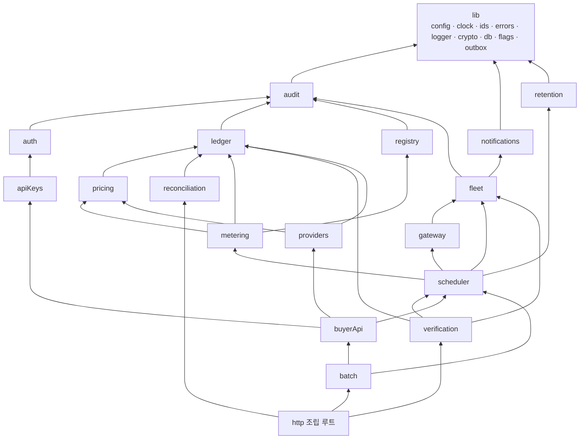
```mermaid
flowchart BT
  lib["lib<br/>config · clock · ids · errors · logger · crypto · db · flags · outbox"]
  audit --> lib
  notifications --> lib
  auth --> audit
  ledger --> audit
  registry --> audit
  apiKeys --> auth
  pricing --> ledger
  fleet --> audit
  fleet --> notifications
  retention --> lib
  reconciliation --> ledger
  gateway --> fleet
  metering --> registry
  metering --> pricing
  metering --> ledger
  scheduler --> gateway
  scheduler --> fleet
  scheduler --> metering
  scheduler --> retention
  verification --> scheduler
  verification --> fleet
  verification --> ledger
  providers --> pricing
  providers --> ledger
  buyerApi --> scheduler
  buyerApi --> apiKeys
  buyerApi --> providers
  batch --> buyerApi
  batch --> scheduler
  http["http 조립 루트"] --> batch
  http --> verification
  http --> reconciliation
```

포트(위 층이 구현, 조립 루트가 연결):
| 포트(정의하는 모듈) | 구현 | 목적 |
|---|---|---|
| `AgentJobSink`(gateway) | scheduler | 노드가 보낸 `job.*` 메시지를 스케줄러로 넘긴다 |
| `SessionLossHook`(gateway) | scheduler | 재개 창 만료 시 진행 중 시도를 실패 처리 |
| `CompletionObserver`(scheduler) | verification | 완료된 작업을 검증 표본 추출기에 알린다 |
| `ReputationSink`(fleet) | verification이 호출 | 평판 점수는 fleet의 노드 속성에 기록(스케줄러는 fleet에서 읽는다) |

아웃박스 이벤트(같은 트랜잭션에서 기록 → 커밋 뒤 전달, 최소 1회, 구독자는 멱등):
`kill.changed`, `policy.changed`, `node.quarantined`, `node.state_changed`, `job.enqueued`, `release.rollout_changed`, `ledger.frozen`, `notification.created`.

- 이 방향은 S05에서 import 경계 검사(테스트 또는 린트 규칙)로 강제한다. 위반은 게이트 실패.
- `ledger`는 다른 도메인을 모른다. 금액·분할·멱등 키는 호출자가 계산해 넘긴다(S06 API).

## 3. 에이전트 모듈

| 패키지(`apps/agent/internal/…`) | 책임 | 담당 차수 |
|---|---|---|
| `state` | 에이전트 상태 기계(유일한 전이 지점, 모든 전이 로그·지표) | S17 |
| `config` | 플래그 > 환경변수 > `config.json` > 기본값, 서버 정책 원자 교체 | S17 |
| `identity` | ed25519 키, `KeyStore`(파일 / DPAPI), 하드웨어 지문 수집·HMAC 두 개, 복제 자가 탐지 | S17, S20, S22 |
| `conn` | WebSocket 연결·인증·재개·재연결(지수 백오프 + 지터), HTTP 클라이언트 한 곳(프록시) | S17, S20 |
| `protocol` | 내장 스키마 검증·타입(S02 생성물) | S02 |
| `executor` | 시도 수명주기(offer → accept/reject → 실행 → chunk → complete/fail), **선점 고우선 경로**, 메모리 전용 작업 데이터 | S17 |
| `runtime` | `Runtime` 인터페이스 + `llamacpp`(운영) · `ollama`(개발) · `fake`(테스트), Job Object/프로세스 그룹 | S17, S19 |
| `presence` | 헬퍼 실행·감시, 파이프 IPC, 전체 화면·GPU 3D 사용 감지 (`presence/windows`) | S18 |
| `policy` | 적격 판정 순수 함수(진리표 테스트), 데드맨 스위치용 '적격 임대' | S18 |
| `gpu` | `nvidia`(nvidia-smi 질의·파서) · `windows`(제조사 무관: DXGI 어댑터, 성능 카운터 `GPU Process Memory`로 프로세스별 VRAM — AMD 시험 노드, ADR 0019), 온도·전력(AMD는 '모름') | S19 |
| `cache` | 아티팩트 내려받기(이어받기·검증·LRU·대역폭), LAN 캐시 서버·클라이언트 | S19, S20 |
| `update` | 업데이트 매니페스트 검증, `binjari-updater`와 협력(버전 폴더·포인터·롤백) | S21 |
| `metrics` | 구조화 로그(콘텐츠 금지·회전), 지표(상태 체류, 선점 지연 3구간), `status`로 서버 보고 | S17 |
| `svc` | Windows 서비스 래퍼(SCM, 세션 변경 알림), 다른 OS에선 '지원 안 함' | S18, S21 |

실행 파일: `binjari-agent`(서비스·콘솔), `binjari-helper`(사용자 세션), `binjari-updater`(교체·롤백), `nodesim`(시뮬레이터).

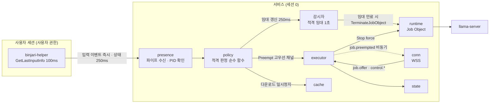
```mermaid
flowchart LR
  subgraph user["사용자 세션 (사용자 권한)"]
    h["binjari-helper<br/>GetLastInputInfo 100ms"]
  end
  subgraph svc["서비스 (세션 0)"]
    pres["presence<br/>파이프 수신 · PID 확인"]
    pol["policy<br/>적격 판정 순수 함수"]
    wd["감시자<br/>적격 임대 1초"]
    exe["executor"]
    rt["runtime<br/>Job Object"]
    conn["conn<br/>WSS"]
    cache["cache"]
    st["state"]
  end
  llama["llama-server"]
  h -->|입력 이벤트 즉시 · 상태 250ms| pres
  pres --> pol
  pol -->|Preempt 고우선 채널| exe
  pol -->|임대 갱신 250ms| wd
  wd -->|임대 만료 시 TerminateJobObject| rt
  exe -->|Stop force| rt
  rt --> llama
  pol -->|다운로드 일시정지| cache
  exe -.->|job.preempted 비동기| conn
  conn -->|job.offer · control.*| exe
  exe --> st
```

- **선점 경로에는 네트워크가 없다**: 헬퍼 → presence → policy → executor → runtime 종료. 서버 통보는 비동기다.
- **감시자(데드맨 스위치)**는 executor·conn과 잠금을 공유하지 않는다. 적격 임대가 1초 넘게 갱신되지 않으면 런타임 Job Object를 종료한다(ADR 0016).
- 작업 데이터(프롬프트·출력)는 executor 메모리에만 있다. `cache`는 서명된 아티팩트만 디스크에 쓴다.

## 4. 핵심 시나리오 시퀀스
표기: `S` = 서버 내부 모듈 이름, `A` = 에이전트. 시간 값은 [7절 시간 예산](#7-시간-예산)의 기본값이다. 원장 호출의 괄호 안은 멱등 키다.

### 4.1 매장 등록 → 설치 → 노드 등록 (single 코드 / image 코드)

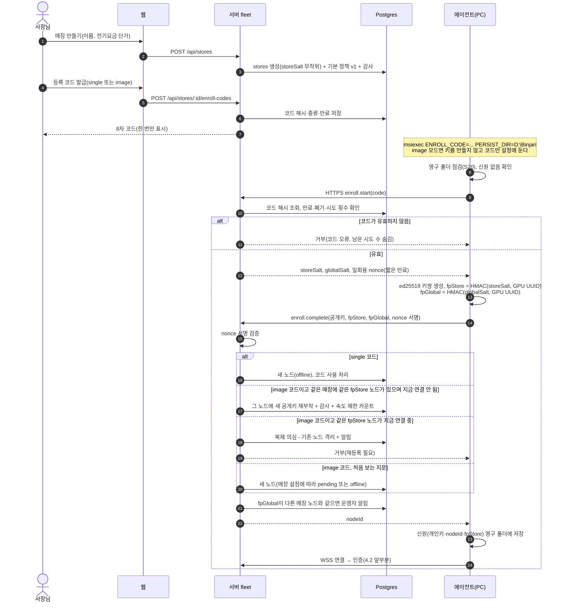
```mermaid
sequenceDiagram
  autonumber
  actor O as 사장님
  participant W as 웹
  participant F as 서버 fleet
  participant DB as Postgres
  participant A as 에이전트(PC)
  O->>W: 매장 만들기(이름, 전기요금 단가)
  W->>F: POST /api/stores
  F->>DB: stores 생성(storeSalt 무작위) + 기본 정책 v1 + 감사
  O->>W: 등록 코드 발급(single 또는 image)
  W->>F: POST /api/stores/:id/enroll-codes
  F->>DB: 코드 해시·종류·만료 저장
  F-->>O: 8자 코드(한 번만 표시)
  Note over A: msiexec ENROLL_CODE=... PERSIST_DIR=D:\Binjari<br/>image 모드면 키를 만들지 않고 코드만 설정에 둔다
  A->>A: 영구 폴더 점검(S20), 신원 없음 확인
  A->>F: HTTPS enroll.start(code)
  F->>DB: 코드 해시 조회, 만료·폐기·시도 횟수 확인
  alt 코드가 유효하지 않음
    F-->>A: 거부(코드 오류, 남은 시도 수 숨김)
  else 유효
    F-->>A: storeSalt, globalSalt, 일회용 nonce(짧은 만료)
    A->>A: ed25519 키쌍 생성, fpStore = HMAC(storeSalt, GPU UUID)<br/>fpGlobal = HMAC(globalSalt, GPU UUID)
    A->>F: enroll.complete(공개키, fpStore, fpGlobal, nonce 서명)
    F->>F: nonce 서명 검증
    alt single 코드
      F->>DB: 새 노드(offline), 코드 사용 처리
    else image 코드이고 같은 매장에 같은 fpStore 노드가 있으며 지금 연결 안 됨
      F->>DB: 그 노드에 새 공개키 재부착 + 감사 + 속도 제한 카운트
    else image 코드이고 같은 fpStore 노드가 지금 연결 중
      F->>DB: 복제 의심 - 기존 노드 격리 + 알림
      F-->>A: 거부(재등록 필요)
    else image 코드, 처음 보는 지문
      F->>DB: 새 노드(매장 설정에 따라 pending 또는 offline)
    end
    F->>DB: fpGlobal이 다른 매장 노드와 같으면 운영자 알림
    F-->>A: nodeId
    A->>A: 신원(개인키·nodeId·fpStore) 영구 폴더에 저장
    A->>F: WSS 연결 → 인증(4.2 앞부분)
  end
```

### 4.2 손님 없음 → 적격 → 오퍼 → 수락 → 실행(스트리밍) → 완료 → 과금 → 수익 보류 → 성숙

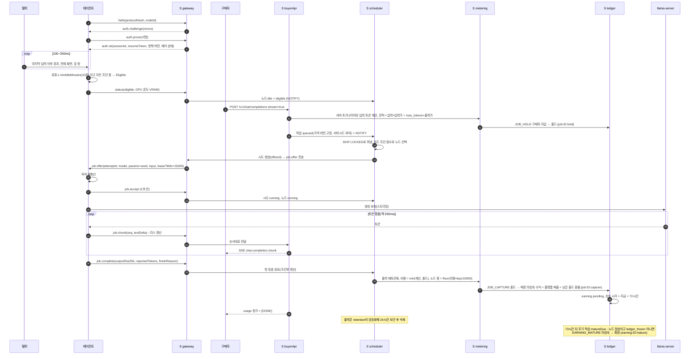
```mermaid
sequenceDiagram
  autonumber
  participant H as 헬퍼
  participant A as 에이전트
  participant G as S gateway
  participant B as 구매자
  participant API as S buyerApi
  participant SC as S scheduler
  participant M as S metering
  participant L as S ledger
  participant R as llama-server
  A->>G: hello(protocolHash, nodeId)
  G-->>A: auth.challenge(nonce)
  A->>G: auth.prove(서명)
  G-->>A: auth.ok(sessionId, resumeToken, 정책 버전, 제어 상태)
  loop 100~250ms
    H->>A: 마지막 입력 이후 경과, 전체 화면, 앞 창
  end
  A->>A: 유휴 ≥ minIdleMinutes(10분) 이고 모든 조건 참 → Eligible
  A->>G: status(eligible, GPU 온도·VRAM)
  G->>SC: 노드 idle + eligible (NOTIFY)
  B->>API: POST /v1/chat/completions stream=true
  API->>M: 서버 토크나이저로 입력 토큰 계산, 견적 = 입력×입력가 + max_tokens×출력가
  M->>L: JOB_HOLD 구매자 지갑 → 홀드 (job:ID:hold)
  API->>SC: 작업 queued(가격 버전 고정, 서버 시드 부여) + NOTIFY
  SC->>SC: SKIP LOCKED로 꺼냄, 하드 조건·점수로 노드 선택
  SC->>G: 시도 생성(offered) → job.offer 전송
  G->>A: job.offer(attemptId, model, params+seed, input, leaseTtlMs=15000)
  A->>A: 적격 재확인
  A->>G: job.accept (2초 안)
  G->>SC: 시도 running, 노드 running
  A->>R: 생성 요청(스트리밍)
  loop 토큰 묶음(약 200ms)
    R-->>A: 토큰
    A->>G: job.chunk(seq, textDelta) - 리스 갱신
    G->>API: 순서대로 전달
    API-->>B: SSE chat.completion.chunk
  end
  A->>G: job.complete(outputSha256, reportedTokens, finishReason)
  G->>SC: 첫 유효 완료(조건부 갱신)
  SC->>M: 출력 재토큰화, 비용 = min(계산, 홀드), 노드 몫 = floor(비용×bps/10000)
  M->>L: JOB_CAPTURE 홀드 → 매장 미성숙 수익 + 플랫폼 매출 + 남은 홀드 환불 (job:ID:capture)
  L->>L: earning pending, 성숙 시각 = 지금 + 72시간
  API-->>B: usage 청크 + [DONE]
  Note over SC: 출력은 retention이 암호화해 24시간 보관 후 삭제
  Note over L: 72시간 뒤 주기 작업 matureDue - 노드 정상이고 ledger_frozen 아니면<br/>EARNING_MATURE 미성숙 → 확정 (earning:ID:mature)
```

### 4.3 손님 착석 → 선점 → 재배정(이어쓰기 포함)

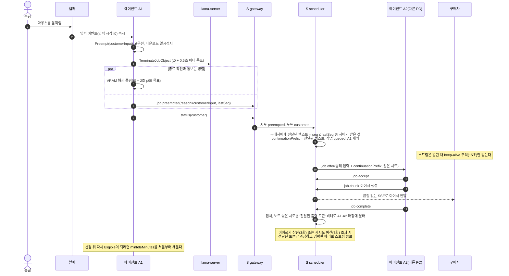
```mermaid
sequenceDiagram
  autonumber
  actor C as 손님
  participant H as 헬퍼
  participant A as 에이전트 A1
  participant R as llama-server
  participant G as S gateway
  participant SC as S scheduler
  participant A2 as 에이전트 A2(다른 PC)
  participant B as 구매자
  C->>H: 마우스를 움직임
  H->>A: 입력 이벤트(입력 시각 t0) 즉시
  A->>A: Preempt(customerInput) 고우선, 다운로드 일시정지
  A->>R: TerminateJobObject (t0 + 0.5초 이내 목표)
  par 종료 확인과 통보는 병렬
    A->>A: VRAM 해제 폴링(t0 + 2초 p95 목표)
  and
    A->>G: job.preempted(reason=customerInput, lastSeq)
  end
  A->>G: status(customer)
  G->>SC: 시도 preempted, 노드 customer
  SC->>SC: 구매자에게 전달된 텍스트 = seq ≤ lastSeq 중 서버가 받은 것<br/>continuationPrefix = 전달된 텍스트, 작업 queued, A1 제외
  Note over B: 스트림은 열린 채 keep-alive 주석(15초)만 받는다
  SC->>A2: job.offer(원래 입력 + continuationPrefix, 같은 시드)
  A2->>SC: job.accept
  A2->>SC: job.chunk 이어서 생성
  SC-->>B: 끊김 없는 SSE로 이어서 전달
  A2->>SC: job.complete
  SC->>SC: 캡처, 노드 몫은 시도별 '전달된 출력 토큰' 비례로 A1·A2 매장에 분배
  Note over SC: 이어쓰기 상한(3회) 또는 재시도 예산(3회) 초과 시<br/>전달된 토큰만 과금하고 명확한 에러로 스트림 종료
  Note over A: 선점 뒤 다시 Eligible이 되려면 minIdleMinutes를 처음부터 채운다
```

### 4.4 구매자 스트리밍 호출 중 클라이언트 연결 끊김

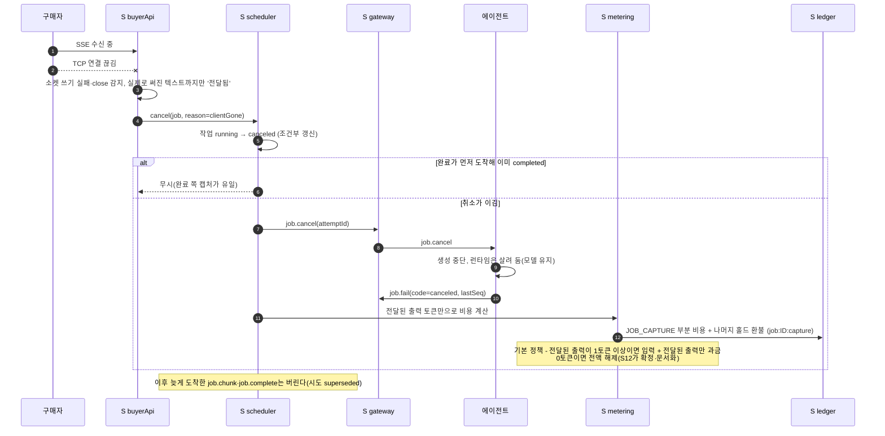
```mermaid
sequenceDiagram
  autonumber
  participant B as 구매자
  participant API as S buyerApi
  participant SC as S scheduler
  participant G as S gateway
  participant A as 에이전트
  participant M as S metering
  participant L as S ledger
  B->>API: SSE 수신 중
  B--xAPI: TCP 연결 끊김
  API->>API: 소켓 쓰기 실패·close 감지, 실제로 써진 텍스트까지만 '전달됨'
  API->>SC: cancel(job, reason=clientGone)
  SC->>SC: 작업 running → canceled (조건부 갱신)
  alt 완료가 먼저 도착해 이미 completed
    SC-->>API: 무시(완료 쪽 캡처가 유일)
  else 취소가 이김
    SC->>G: job.cancel(attemptId)
    G->>A: job.cancel
    A->>A: 생성 중단, 런타임은 살려 둠(모델 유지)
    A->>G: job.fail(code=canceled, lastSeq)
    SC->>M: 전달된 출력 토큰만으로 비용 계산
    M->>L: JOB_CAPTURE 부분 비용 + 나머지 홀드 환불 (job:ID:capture)
    Note over M: 기본 정책 - 전달된 출력이 1토큰 이상이면 입력 + 전달된 출력만 과금<br/>0토큰이면 전액 해제(S12가 확정·문서화)
  end
  Note over SC: 이후 늦게 도착한 job.chunk·job.complete는 버린다(시도 superseded)
```

### 4.5 배치 업로드 → 분할 → 진행 → 결과

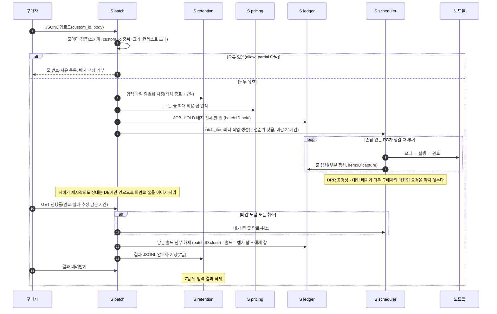
```mermaid
sequenceDiagram
  autonumber
  participant B as 구매자
  participant BA as S batch
  participant RT as S retention
  participant P as S pricing
  participant L as S ledger
  participant SC as S scheduler
  participant N as 노드들
  B->>BA: JSONL 업로드(custom_id, body)
  BA->>BA: 줄마다 검증(스키마, custom_id 중복, 크기, 컨텍스트 초과)
  alt 오류 있음(allow_partial 아님)
    BA-->>B: 줄 번호·사유 목록, 배치 생성 거부
  else 모두 유효
    BA->>RT: 입력 파일 암호화 저장(배치 종료 + 7일)
    BA->>P: 모든 줄 최대 비용 합 견적
    BA->>L: JOB_HOLD 배치 전체 한 번 (batch:ID:hold)
    BA->>SC: batch_item마다 작업 생성(우선순위 낮음, 마감 24시간)
    loop 손님 없는 PC가 생길 때마다
      SC->>N: 오퍼 → 실행 → 완료
      SC->>L: 줄 캡처(부분 캡처, item:ID:capture)
    end
    Note over SC: DRR 공정성 - 대형 배치가 다른 구매자의 대화형 요청을 막지 않는다
    Note over BA: 서버가 재시작돼도 상태는 DB에만 있으므로 미완료 줄을 이어서 처리
    B->>BA: GET 진행률(완료·실패·추정 남은 시간)
    alt 마감 도달 또는 취소
      BA->>SC: 대기 중 줄 만료·취소
    end
    BA->>L: 남은 홀드 전부 해제 (batch:ID:close) - 홀드 = 캡처 합 + 해제 합
    BA->>RT: 결과 JSONL 암호화 저장(7일)
    B->>BA: 결과 내려받기
    Note over RT: 7일 뒤 입력·결과 삭제
  end
```

### 4.6 외부 모델 환전 + 준비금 가드

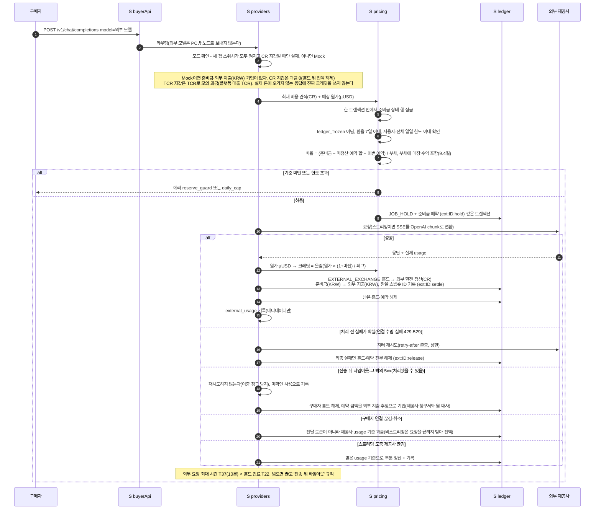
```mermaid
sequenceDiagram
  autonumber
  participant B as 구매자
  participant API as S buyerApi
  participant PR as S providers
  participant P as S pricing
  participant L as S ledger
  participant X as 외부 제공사
  B->>API: POST /v1/chat/completions model=외부 모델
  API->>PR: 라우팅(외부 모델은 PC방 노드로 보내지 않는다)
  PR->>PR: 모드 확인 - 세 겹 스위치가 모두 켜지고 CR 지갑일 때만 실제, 아니면 Mock
  Note over PR: Mock이면 준비금·외부 지출(KRW) 기입이 없다. CR 지갑은 과금 0(홀드 뒤 전액 해제)<br/>TCR 지갑은 TCR로 모의 과금(플랫폼 매출 TCR). 실제 돈이 오가지 않는 응답에 진짜 크레딧을 쓰지 않는다
  PR->>P: 최대 비용 견적(CR) + 예상 원가(µUSD)
  P->>P: 한 트랜잭션 안에서 준비금 상태 행 잠금
  P->>P: ledger_frozen 아님, 환율 7일 이내, 사용자·전체 일일 한도 이내 확인
  P->>P: 비율 = (준비금 − 미정산 예약 합 − 이번 예약) / 부채, 부채에 매장 수익 포함(9.4절)
  alt 기준 미만 또는 한도 초과
    P-->>B: 에러 reserve_guard 또는 daily_cap
  else 허용
    P->>L: JOB_HOLD + 준비금 예약 (ext:ID:hold) 같은 트랜잭션
    PR->>X: 요청(스트리밍이면 SSE를 OpenAI chunk로 변환)
    alt 성공
      X-->>PR: 응답 + 실제 usage
      PR->>P: 원가 µUSD → 크레딧 = 올림(원가 × (1+마진) / 페그)
      PR->>L: EXTERNAL_EXCHANGE 홀드 → 외부 환전 정산(CR)<br/>준비금(KRW) → 외부 지출(KRW), 환율 스냅숏 ID 기록 (ext:ID:settle)
      PR->>L: 남은 홀드·예약 해제
      PR->>PR: external_usage 기록(메타데이터만)
    else 처리 전 실패가 확실(연결 수립 실패·429·529)
      PR->>X: 지터 재시도(retry-after 존중, 상한)
      PR->>L: 최종 실패면 홀드·예약 전부 해제 (ext:ID:release)
    else 전송 뒤 타임아웃·그 밖의 5xx(처리됐을 수 있음)
      PR->>PR: 재시도하지 않는다(이중 청구 방지), 미확인 사용으로 기록
      PR->>L: 구매자 홀드 해제, 예약 금액을 외부 지출 추정으로 기입(제공사 청구서와 월 대사)
    else 구매자 연결 끊김·취소
      PR->>L: 전달 토큰이 아니라 제공사 usage 기준 과금(비스트리밍은 요청을 끝까지 받아 전액)
    else 스트리밍 도중 제공사 끊김
      PR->>L: 받은 usage 기준으로 부분 정산 + 기록
    end
    Note over PR: 외부 요청 최대 시간 T37(10분) < 홀드 만료 T22. 넘으면 끊고 '전송 뒤 타임아웃' 규칙
  end
```

### 4.7 검증(카나리아·중복·지문) → 판정 → 평판 → 격리·회수

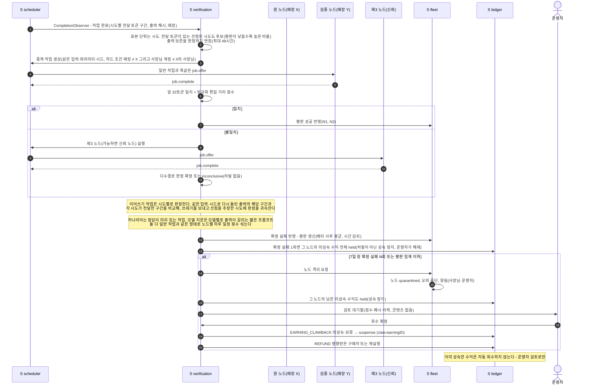
```mermaid
sequenceDiagram
  autonumber
  participant SC as S scheduler
  participant V as S verification
  participant N1 as 원 노드(매장 X)
  participant N2 as 검증 노드(매장 Y)
  participant N3 as 제3 노드(신뢰)
  participant F as S fleet
  participant L as S ledger
  actor OP as 운영자
  SC->>V: CompletionObserver - 작업 완료(시도별 전달 토큰 구간, 출력 해시, 매장)
  V->>V: 표본 단위는 시도. 전달 토큰이 있는 선점된 시도도 후보(평판이 낮을수록 높은 비율)<br/>출력 보존을 판정까지 연장(최대 48시간)
  V->>SC: 중복 작업 생성(같은 입력·파라미터·시드, 하드 조건 매장 ≠ X 그리고 사장님 계정 ≠ X의 사장님)
  SC->>N2: 일반 작업과 똑같은 job.offer
  N2-->>SC: job.complete
  V->>V: 앞 32토큰 일치 + 정규화 편집 거리 점수
  alt 일치
    V->>F: 평판 성공 반영(N1, N2)
  else 불일치
    V->>SC: 제3 노드(가능하면 신뢰 노드) 실행
    SC->>N3: job.offer
    N3-->>SC: job.complete
    V->>V: 다수결로 판정 확정 또는 inconclusive(처벌 없음)
  end
  Note over V: 이어쓰기 작업은 시도별로 판정한다. 같은 입력·시드로 다시 돌린 출력의 해당 구간과<br/>각 시도가 전달한 구간을 비교해, 쓰레기를 보내고 선점을 주장한 시도에 판정을 귀속한다
  Note over V: 카나리아는 정답이 미리 있는 작업, 모델 지문은 모델별로 출력이 갈리는 짧은 프롬프트<br/>둘 다 일반 작업과 같은 형태로 노드별 하루 일정 횟수 섞는다
  V->>F: 확정 실패 반영 - 평판 갱신(베타 사후 평균, 시간 감쇠)
  V->>L: 확정 실패 1회면 그 노드의 미성숙 수익 전체 held(처벌이 아닌 성숙 정지, 운영자가 해제)
  alt 7일 창 확정 실패 N회 또는 평판 임계 이하
    V->>F: 노드 격리 요청
    F->>F: 노드 quarantined, 오퍼 중단, 알림(사장님·운영자)
    V->>L: 그 노드의 남은 미성숙 수익도 held(성숙 정지)
    V->>OP: 검토 대기열(점수·해시·이력, 콘텐츠 없음)
    OP->>V: 회수 확정
    V->>L: EARNING_CLAWBACK 미성숙·보류 → suspense (claw:earningID)
    V->>L: REFUND 영향받은 구매자 또는 재실행
  end
  Note over L: 이미 성숙한 수익은 자동 회수하지 않는다 - 운영자 검토로만
```

### 4.8 에이전트 업데이트 단계적 배포 → 실패 → 자동 롤백

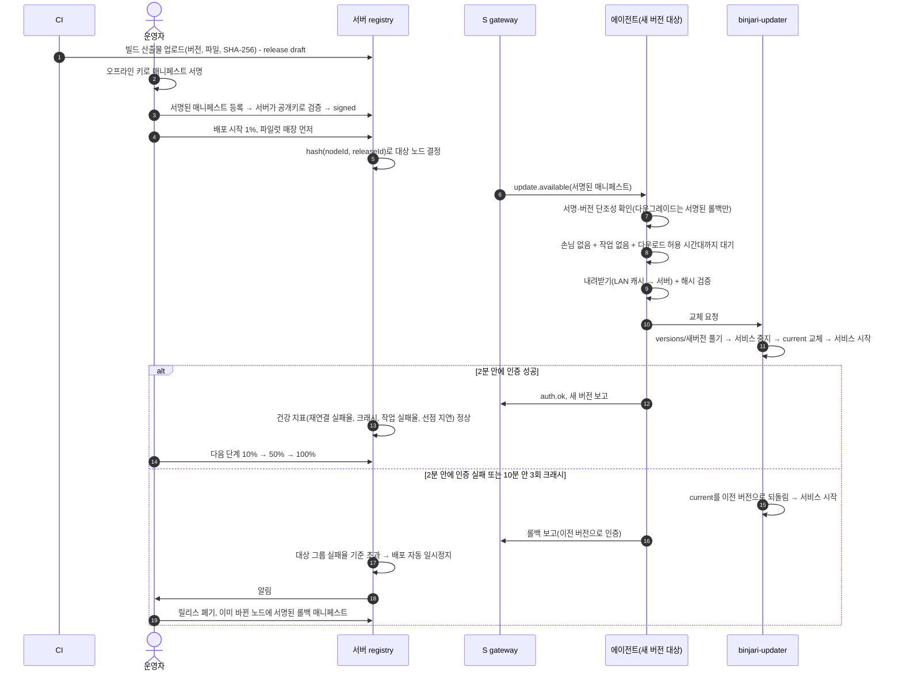
```mermaid
sequenceDiagram
  autonumber
  participant CI as CI
  actor OP as 운영자
  participant S as 서버 registry
  participant G as S gateway
  participant A as 에이전트(새 버전 대상)
  participant U as binjari-updater
  CI->>S: 빌드 산출물 업로드(버전, 파일, SHA-256) - release draft
  OP->>OP: 오프라인 키로 매니페스트 서명
  OP->>S: 서명된 매니페스트 등록 → 서버가 공개키로 검증 → signed
  OP->>S: 배포 시작 1%, 파일럿 매장 먼저
  S->>S: hash(nodeId, releaseId)로 대상 노드 결정
  G->>A: update.available(서명된 매니페스트)
  A->>A: 서명·버전 단조성 확인(다운그레이드는 서명된 롤백만)
  A->>A: 손님 없음 + 작업 없음 + 다운로드 허용 시간대까지 대기
  A->>A: 내려받기(LAN 캐시 → 서버) + 해시 검증
  A->>U: 교체 요청
  U->>U: versions/새버전 풀기 → 서비스 중지 → current 교체 → 서비스 시작
  alt 2분 안에 인증 성공
    A->>G: auth.ok, 새 버전 보고
    S->>S: 건강 지표(재연결 실패율, 크래시, 작업 실패율, 선점 지연) 정상
    OP->>S: 다음 단계 10% → 50% → 100%
  else 2분 안에 인증 실패 또는 10분 안 3회 크래시
    U->>U: current를 이전 버전으로 되돌림 → 서비스 시작
    A->>G: 롤백 보고(이전 버전으로 인증)
    S->>S: 대상 그룹 실패율 기준 초과 → 배포 자동 일시정지
    S->>OP: 알림
    OP->>S: 릴리스 폐기, 이미 바뀐 노드에 서명된 롤백 매니페스트
  end
```

### 4.9 킬스위치 (노드 / 매장 / 전체)

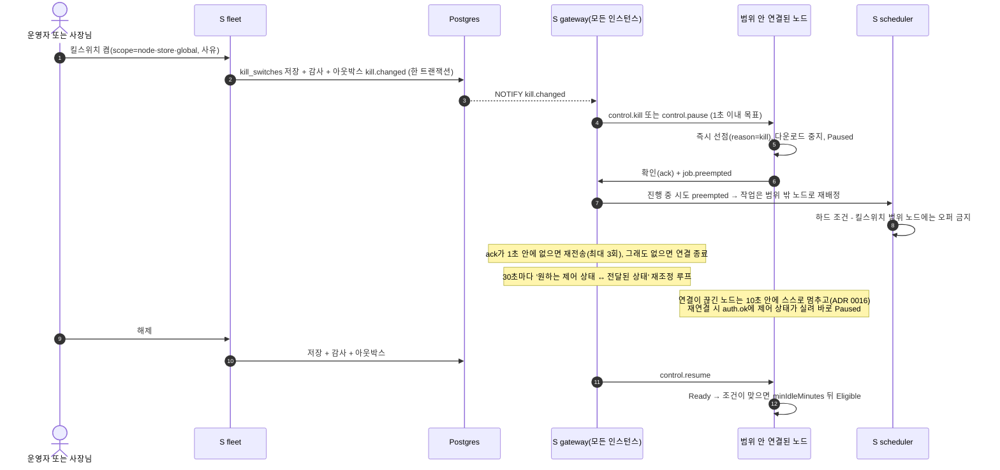
```mermaid
sequenceDiagram
  autonumber
  actor OP as 운영자 또는 사장님
  participant F as S fleet
  participant DB as Postgres
  participant G as S gateway(모든 인스턴스)
  participant A as 범위 안 연결된 노드
  participant SC as S scheduler
  OP->>F: 킬스위치 켬(scope=node·store·global, 사유)
  F->>DB: kill_switches 저장 + 감사 + 아웃박스 kill.changed (한 트랜잭션)
  DB-->>G: NOTIFY kill.changed
  G->>A: control.kill 또는 control.pause (1초 이내 목표)
  A->>A: 즉시 선점(reason=kill), 다운로드 중지, Paused
  A->>G: 확인(ack) + job.preempted
  G->>SC: 진행 중 시도 preempted → 작업은 범위 밖 노드로 재배정
  SC->>SC: 하드 조건 - 킬스위치 범위 노드에는 오퍼 금지
  Note over G: ack가 1초 안에 없으면 재전송(최대 3회), 그래도 없으면 연결 종료
  Note over G: 30초마다 '원하는 제어 상태 ↔ 전달된 상태' 재조정 루프
  Note over A: 연결이 끊긴 노드는 10초 안에 스스로 멈추고(ADR 0016)<br/>재연결 시 auth.ok에 제어 상태가 실려 바로 Paused
  OP->>F: 해제
  F->>DB: 저장 + 감사 + 아웃박스
  G->>A: control.resume
  A->>A: Ready → 조건이 맞으면 minIdleMinutes 뒤 Eligible
```

### 4.10 복원 솔루션 PC 재부팅 → 신원 재부착, 그리고 이미지 복제 충돌

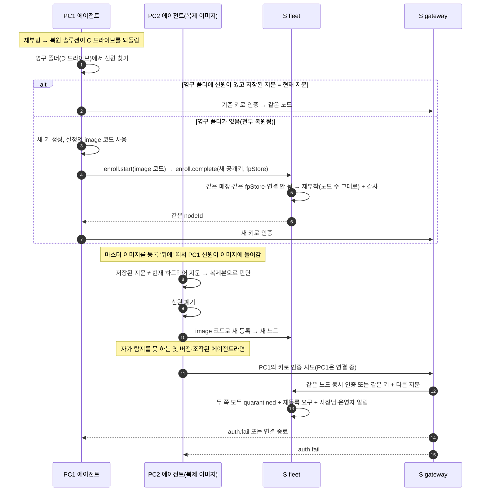
```mermaid
sequenceDiagram
  autonumber
  participant P1 as PC1 에이전트
  participant P2 as PC2 에이전트(복제 이미지)
  participant F as S fleet
  participant G as S gateway
  Note over P1: 재부팅 → 복원 솔루션이 C 드라이브를 되돌림
  P1->>P1: 영구 폴더(D 드라이브)에서 신원 찾기
  alt 영구 폴더에 신원이 있고 저장된 지문 = 현재 지문
    P1->>G: 기존 키로 인증 → 같은 노드
  else 영구 폴더가 없음(전부 복원됨)
    P1->>P1: 새 키 생성, 설정의 image 코드 사용
    P1->>F: enroll.start(image 코드) → enroll.complete(새 공개키, fpStore)
    F->>F: 같은 매장·같은 fpStore·연결 안 됨 → 재부착(노드 수 그대로) + 감사
    F-->>P1: 같은 nodeId
    P1->>G: 새 키로 인증
  end
  Note over P2: 마스터 이미지를 등록 '뒤에' 떠서 PC1 신원이 이미지에 들어감
  P2->>P2: 저장된 지문 ≠ 현재 하드웨어 지문 → 복제본으로 판단
  P2->>P2: 신원 폐기
  P2->>F: image 코드로 새 등록 → 새 노드
  Note over P2: 자가 탐지를 못 하는 옛 버전·조작된 에이전트라면
  P2->>G: PC1의 키로 인증 시도(PC1은 연결 중)
  G->>F: 같은 노드 동시 인증 또는 같은 키 + 다른 지문
  F->>F: 두 쪽 모두 quarantined + 재등록 요구 + 사장님·운영자 알림
  G-->>P1: auth.fail 또는 연결 종료
  G-->>P2: auth.fail
```

## 5. 상태 기계
모든 전이에 `[주체]`를 적는다. 주체 어휘: 에이전트, 헬퍼, 업데이터, 손님, 사장님, 운영자, 구매자, 서버, 게이트웨이, 스케줄러, 플릿, 원장, 계량, 검증, 배치, 외부제공사, 릴리스, 시계(타이머·주기 작업), CI. `scripts/check-docs.mjs`가 이 표기를 검사한다. 허용되지 않는 전이는 DB 조건부 갱신(`WHERE status = 'x'`)으로 막는다(S10, S12).

### 5.1 노드 (서버 쪽)
- `idle`은 '손님 없음'이다. 작업을 실제로 받을 수 있는지는 속성 `eligible`(+ 사유 코드: 일정 밖, 온도, 헬퍼 없음 등)로 따로 둔다. 스케줄러 하드 조건은 `state = idle AND eligible`.
- `pending`(승인 대기)은 S10 목록에 더한 상태다([12절](#12-이견-명세와-다르게-설계한-것)).
- `disabled`는 사장님이 끈 PC(사장님이 다시 켤 수 있음), `excluded`는 운영자가 부정으로 영구 제외한 PC(운영자만 해제)다. 둘을 나눠 사장님이 운영자 제외를 풀지 못하게 한다(D20).
- 오퍼를 보낸 동안 노드에는 '오퍼 중' 표시(`offeredAttemptId`)가 붙는다. 스케줄러 하드 조건은 `state = idle AND eligible AND 오퍼 중 아님`이라 2초 오퍼 창 안에 두 번째 오퍼가 가지 않는다.

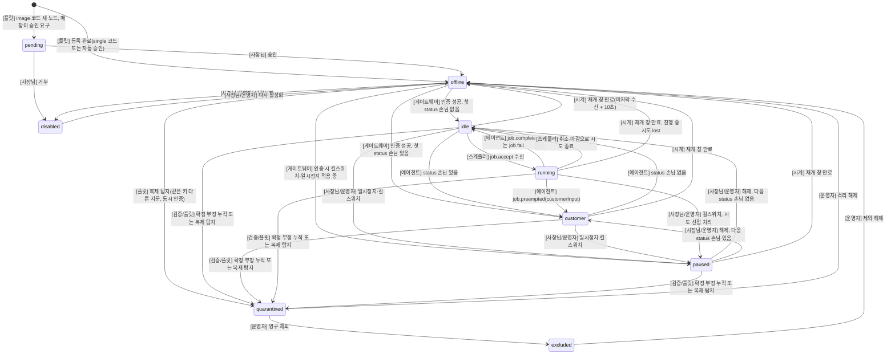
```mermaid
stateDiagram-v2
  [*] --> pending : [플릿] image 코드 새 노드, 매장이 승인 요구
  [*] --> offline : [플릿] 등록 완료(single 코드 또는 자동 승인)
  pending --> offline : [사장님] 승인
  pending --> disabled : [사장님] 거부
  offline --> idle : [게이트웨이] 인증 성공, 첫 status 손님 없음
  offline --> customer : [게이트웨이] 인증 성공, 첫 status 손님 있음
  offline --> paused : [게이트웨이] 인증 시 킬스위치·일시정지 적용 중
  offline --> quarantined : [플릿] 복제 탐지(같은 키 다른 지문, 동시 인증)
  idle --> running : [스케줄러] job.accept 수신
  idle --> customer : [에이전트] status 손님 있음
  customer --> idle : [에이전트] status 손님 없음
  running --> idle : [에이전트] job.complete 또는 job.fail
  running --> customer : [에이전트] job.preempted(customerInput)
  running --> idle : [스케줄러] 취소·마감으로 시도 종료
  idle --> offline : [시계] 재개 창 만료(마지막 수신 + 10초)
  customer --> offline : [시계] 재개 창 만료
  running --> offline : [시계] 재개 창 만료, 진행 중 시도 lost
  idle --> paused : [사장님/운영자] 일시정지·킬스위치
  customer --> paused : [사장님/운영자] 일시정지·킬스위치
  running --> paused : [사장님/운영자] 킬스위치, 시도 선점 처리
  paused --> idle : [사장님/운영자] 해제, 다음 status 손님 없음
  paused --> customer : [사장님/운영자] 해제, 다음 status 손님 있음
  paused --> offline : [시계] 재개 창 만료
  idle --> quarantined : [검증/플릿] 확정 부정 누적 또는 복제 탐지
  customer --> quarantined : [검증/플릿] 확정 부정 누적 또는 복제 탐지
  running --> quarantined : [검증/플릿] 확정 부정 누적 또는 복제 탐지
  paused --> quarantined : [검증/플릿] 확정 부정 누적 또는 복제 탐지
  quarantined --> offline : [운영자] 격리 해제
  quarantined --> excluded : [운영자] 영구 제외
  excluded --> offline : [운영자] 제외 해제
  offline --> disabled : [사장님/운영자] 비활성화
  disabled --> offline : [사장님/운영자] 다시 활성화
```

### 5.2 작업 (job)

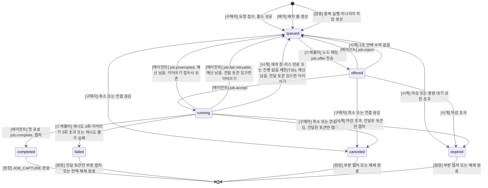
```mermaid
stateDiagram-v2
  [*] --> queued : [구매자] 요청 접수, 홀드 성공
  [*] --> queued : [배치] 배치 줄 생성
  [*] --> queued : [검증] 중복 실행·카나리아 작업 생성
  queued --> offered : [스케줄러] 노드 매칭, job.offer 전송
  offered --> running : [에이전트] job.accept
  offered --> queued : [에이전트] job.reject
  offered --> queued : [시계] 2초 안에 수락 없음
  running --> completed : [에이전트] 첫 유효 job.complete, 캡처
  running --> queued : [에이전트] job.preempted, 예산 남음, 이어쓰기 접두사 보존
  running --> queued : [에이전트] job.fail retryable, 예산 남음, 전달 토큰 있으면 이어쓰기
  running --> queued : [시계] 재개 창·리스 만료 또는 진행 없음 제한(T35), 예산 남음, 전달 토큰 있으면 이어쓰기
  running --> failed : [스케줄러] 재시도 3회·이어쓰기 3회 초과 또는 재시도 불가 실패
  queued --> canceled : [구매자] 취소 또는 연결 끊김
  offered --> canceled : [구매자] 취소 또는 연결 끊김
  running --> canceled : [구매자] 취소 또는 연결 끊김, 전달된 토큰만 캡처
  queued --> expired : [시계] 마감 또는 용량 대기 상한 초과
  offered --> expired : [시계] 마감 초과
  running --> expired : [시계] 마감 초과, 전달된 토큰만 캡처
  completed --> [*] : [원장] JOB_CAPTURE 완료
  failed --> [*] : [원장] 전달 토큰만 부분 캡처 또는 전액 해제 완료
  canceled --> [*] : [원장] 부분 캡처 또는 해제 완료
  expired --> [*] : [원장] 부분 캡처 또는 해제 완료
```

### 5.3 시도 (attempt)

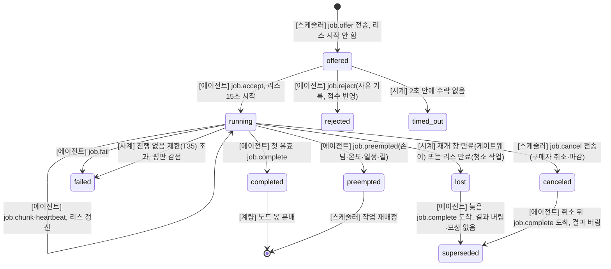
```mermaid
stateDiagram-v2
  [*] --> offered : [스케줄러] job.offer 전송, 리스 시작 안 함
  offered --> running : [에이전트] job.accept, 리스 15초 시작
  offered --> rejected : [에이전트] job.reject(사유 기록, 점수 반영)
  offered --> timed_out : [시계] 2초 안에 수락 없음
  running --> running : [에이전트] job.chunk·heartbeat, 리스 갱신
  running --> completed : [에이전트] 첫 유효 job.complete
  running --> failed : [에이전트] job.fail
  running --> preempted : [에이전트] job.preempted(손님·온도·일정·킬)
  running --> canceled : [스케줄러] job.cancel 전송(구매자 취소·마감)
  running --> lost : [시계] 재개 창 만료(게이트웨이) 또는 리스 만료(청소 작업)
  running --> failed : [시계] 진행 없음 제한(T35) 초과, 평판 감점
  lost --> superseded : [에이전트] 늦은 job.complete 도착, 결과 버림·보상 없음
  canceled --> superseded : [에이전트] 취소 뒤 job.complete 도착, 결과 버림
  completed --> [*] : [계량] 노드 몫 분배
  preempted --> [*] : [스케줄러] 작업 재배정
```

### 5.4 홀드 (hold)
배치 홀드만 `active` 상태에서 여러 번 부분 캡처·부분 해제를 한다. 외부 환전의 준비금 예약은 홀드와 같은 수명을 갖는다(같은 트랜잭션에서 생기고 끝난다).

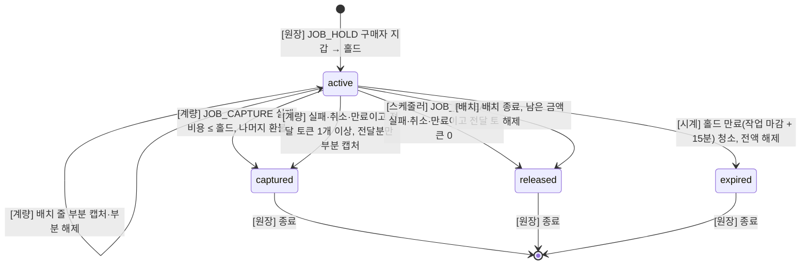
```mermaid
stateDiagram-v2
  [*] --> active : [원장] JOB_HOLD 구매자 지갑 → 홀드
  active --> active : [계량] 배치 줄 부분 캡처·부분 해제
  active --> captured : [계량] JOB_CAPTURE 실제 비용 ≤ 홀드, 나머지 환불
  active --> captured : [계량] 실패·취소·만료이고 전달 토큰 1개 이상, 전달분만 부분 캡처
  active --> released : [스케줄러] JOB_RELEASE 실패·취소·만료이고 전달 토큰 0
  active --> released : [배치] 배치 종료, 남은 금액 해제
  active --> expired : [시계] 홀드 만료(작업 마감 + 15분) 청소, 전액 해제
  captured --> [*] : [원장] 종료
  released --> [*] : [원장] 종료
  expired --> [*] : [원장] 종료
```
- 캡처와 만료가 경합하면 조건부 갱신으로 정확히 하나만 이긴다(S06 수용 기준 3). 홀드 만료는 작업 마감보다 늦으므로 정상 완료가 만료와 겹치지 않는다.

### 5.5 수익 (earning)

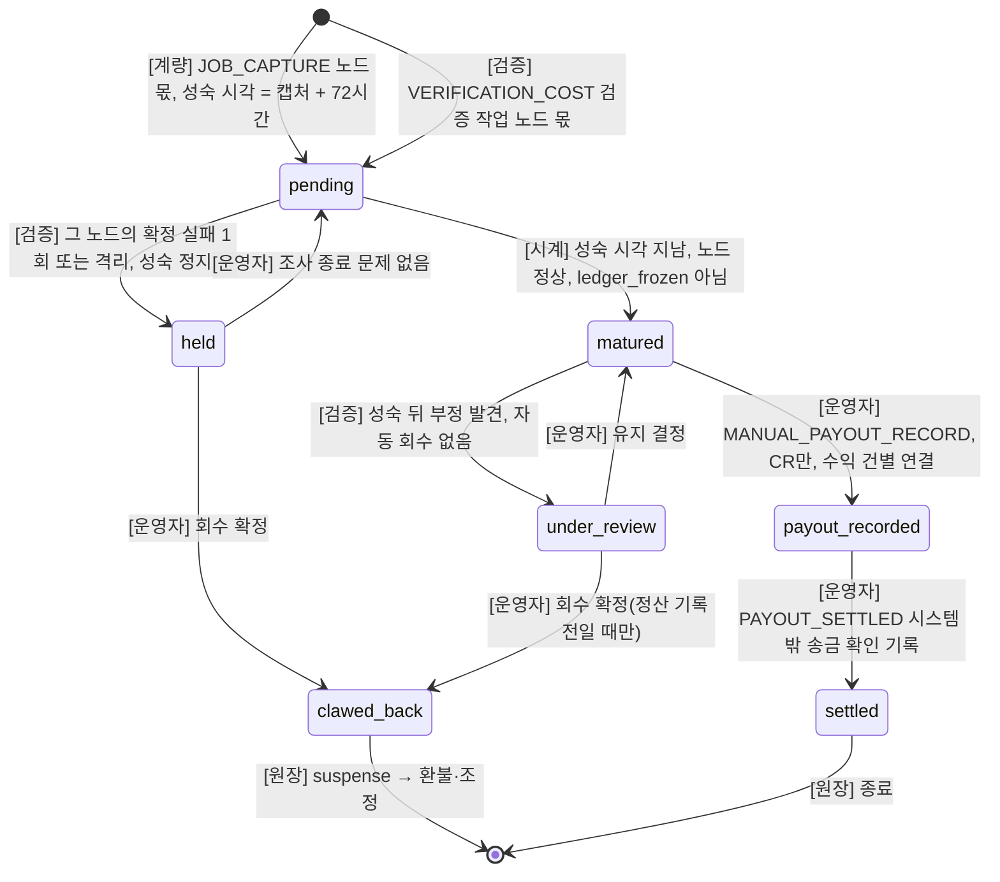
```mermaid
stateDiagram-v2
  [*] --> pending : [계량] JOB_CAPTURE 노드 몫, 성숙 시각 = 캡처 + 72시간
  [*] --> pending : [검증] VERIFICATION_COST 검증 작업 노드 몫
  pending --> matured : [시계] 성숙 시각 지남, 노드 정상, ledger_frozen 아님
  pending --> held : [검증] 그 노드의 확정 실패 1회 또는 격리, 성숙 정지
  held --> pending : [운영자] 조사 종료 문제 없음
  held --> clawed_back : [운영자] 회수 확정
  matured --> under_review : [검증] 성숙 뒤 부정 발견, 자동 회수 없음
  under_review --> matured : [운영자] 유지 결정
  under_review --> clawed_back : [운영자] 회수 확정(정산 기록 전일 때만)
  matured --> payout_recorded : [운영자] MANUAL_PAYOUT_RECORD, CR만, 수익 건별 연결
  payout_recorded --> settled : [운영자] PAYOUT_SETTLED 시스템 밖 송금 확인 기록
  clawed_back --> [*] : [원장] suspense → 환불·조정
  settled --> [*] : [원장] 종료
```
- TCR(샌드박스 크레딧)로 생긴 수익은 `matured`까지만 간다. `payout_recorded` 전이는 CR에만 허용(ADR 0005).
- 회수(`clawed_back`)는 언제나 운영자가 확정한다. 검증은 `held`·`under_review`로 멈추기만 한다(1인 운영 v0.1. 자동 회수는 S13이 근거와 함께 ADR로 정할 수 있다).
- `MANUAL_PAYOUT_RECORD`는 `matured` 수익 건을 하나하나 연결해 기록한다. `under_review` 수익은 연결할 수 없다(M10).

### 5.6 에이전트 릴리스 (서버 쪽)

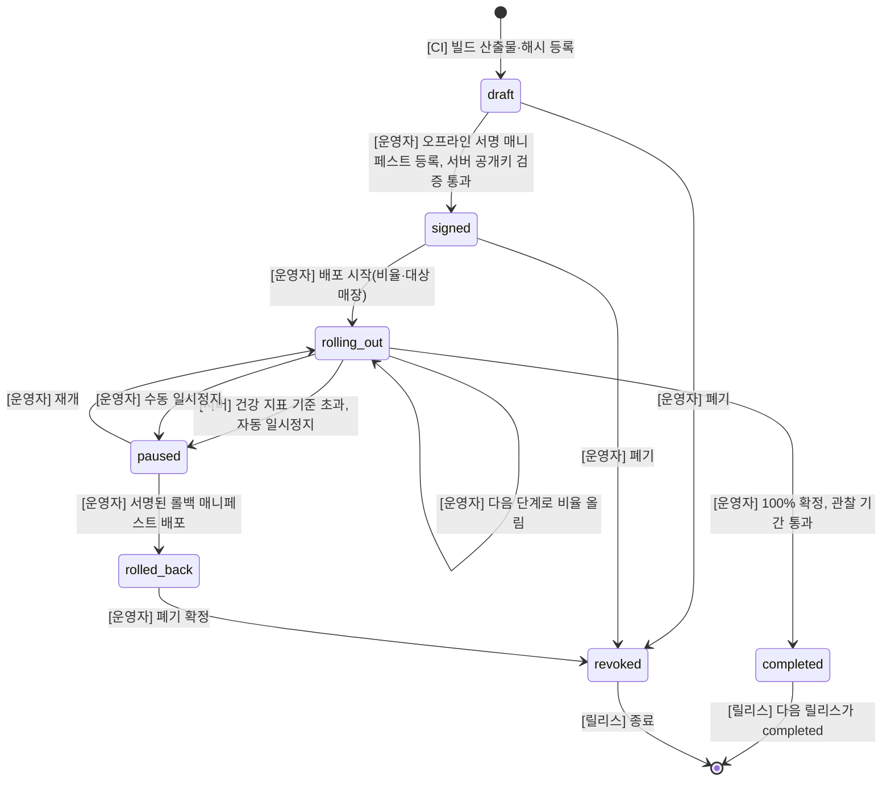
```mermaid
stateDiagram-v2
  [*] --> draft : [CI] 빌드 산출물·해시 등록
  draft --> signed : [운영자] 오프라인 서명 매니페스트 등록, 서버 공개키 검증 통과
  draft --> revoked : [운영자] 폐기
  signed --> rolling_out : [운영자] 배포 시작(비율·대상 매장)
  signed --> revoked : [운영자] 폐기
  rolling_out --> rolling_out : [운영자] 다음 단계로 비율 올림
  rolling_out --> paused : [서버] 건강 지표 기준 초과, 자동 일시정지
  rolling_out --> paused : [운영자] 수동 일시정지
  paused --> rolling_out : [운영자] 재개
  paused --> rolled_back : [운영자] 서명된 롤백 매니페스트 배포
  rolling_out --> completed : [운영자] 100% 확정, 관찰 기간 통과
  rolled_back --> revoked : [운영자] 폐기 확정
  completed --> [*] : [릴리스] 다음 릴리스가 completed
  revoked --> [*] : [릴리스] 종료
```

### 5.7 에이전트 로컬 상태 (참고 — S17이 구현)

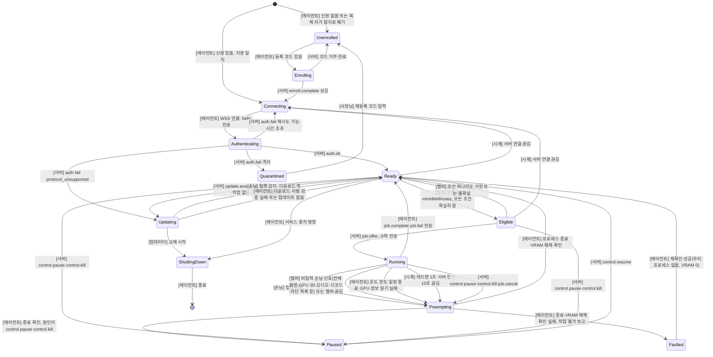
```mermaid
stateDiagram-v2
  [*] --> Unenrolled : [에이전트] 신원 없음 또는 복제 자가 탐지로 폐기
  [*] --> Connecting : [에이전트] 신원 있음, 지문 일치
  Unenrolled --> Enrolling : [에이전트] 등록 코드 있음
  Enrolling --> Connecting : [서버] enroll.complete 성공
  Enrolling --> Unenrolled : [서버] 코드 거부·만료
  Connecting --> Authenticating : [에이전트] WSS 연결, hello 전송
  Authenticating --> Ready : [서버] auth.ok
  Authenticating --> Connecting : [서버] auth.fail 재시도 가능·시간 초과
  Authenticating --> Quarantined : [서버] auth.fail 격리
  Authenticating --> Updating : [서버] auth.fail protocol_unsupported
  Ready --> Eligible : [헬퍼] 유휴 ≥ minIdleMinutes, 모든 조건 확실히 참
  Eligible --> Ready : [헬퍼] 조건 하나라도 거짓 또는 불확실
  Eligible --> Running : [서버] job.offer, 수락 전송
  Running --> Ready : [에이전트] job.complete·job.fail 전송
  Running --> Preempting : [손님] 입력 감지
  Running --> Preempting : [헬퍼] 비입력 손님 신호(전체 화면·GPU 3D·오디오·디코드·차단 목록 창) 또는 헬퍼 끊김
  Running --> Preempting : [에이전트] 온도 한도·일정 종료·GPU 정보 읽기 실패
  Running --> Preempting : [시계] 데드맨 1초·서버 연락 10초 끊김
  Running --> Preempting : [서버] control.pause·control.kill·job.cancel
  Preempting --> Ready : [에이전트] 프로세스 종료·VRAM 해제 확인
  Preempting --> Paused : [에이전트] 종료 확인, 원인이 control.pause·control.kill
  Preempting --> Faulted : [에이전트] 종료·VRAM 해제 확인 실패, 작업 불가 보고
  Faulted --> Ready : [에이전트] 재확인 성공(우리 프로세스 없음, VRAM 0)
  Ready --> Paused : [서버] control.pause·control.kill
  Eligible --> Paused : [서버] control.pause·control.kill
  Paused --> Ready : [서버] control.resume
  Ready --> Connecting : [시계] 서버 연결 끊김
  Eligible --> Connecting : [시계] 서버 연결 끊김
  Ready --> Updating : [서버] update.available, 유휴·작업 없음
  Updating --> ShuttingDown : [업데이터] 교체 시작
  Updating --> Ready : [손님] 입력 감지, 다운로드 즉시 정지
  Updating --> Ready : [에이전트] 다운로드·서명 검증 실패 또는 업데이트 없음
  Ready --> ShuttingDown : [에이전트] 서비스 중지 명령
  Quarantined --> Unenrolled : [사장님] 재등록 코드 입력
  ShuttingDown --> [*] : [에이전트] 종료
```
- `Preempting`에서 다른 어떤 상태로도 '실행 중'으로 바로 돌아가지 않는다. 선점 뒤에는 `Ready`에서 유휴 시간을 처음부터 채운다.
- 적격 임대(T4)는 `Eligible`·`Running`에서 적격 판정이 '확실히 참'일 때만 갱신된다. 판정이 거짓·불확실이면 갱신이 멈추므로, 선점 메시지가 늦거나 사라져도 데드맨이 1초 안에 종료한다. 임대는 '살아 있음' 신호가 아니다.
- `Faulted`는 서버에 eligible=false(사유 `runtime_fault`)로 보고된다. `Updating` 중 다운로드는 손님 신호에 즉시 멈춘다(ADR 0016).

## 6. 데이터 흐름과 보존
구매자 콘텐츠(프롬프트·출력·배치 파일)가 지나가는 모든 곳. 원칙은 ADR 0010. '목표'는 측정·확인 전 값이다.

```mermaid
flowchart LR
  B["구매자"] -->|TLS| API["서버 메모리<br/>요청 처리 중"]
  API -->|AES-256-GCM| DB[("job_payloads<br/>24시간")]
  API -->|TLS WSS 또는 inputRef HTTPS| AG["에이전트 메모리<br/>시도 동안"]
  AG -->|127.0.0.1 HTTP| RT["llama-server 메모리·VRAM<br/>프로세스 종료 시 해제"]
  RT --> AG
  AG -->|job.chunk TLS| API
  API -->|SSE TLS| B
  API -->|외부 모델만, TLS| X["외부 제공사<br/>제공사 정책 · 확인 필요"]
  API -. 길이·해시만 .-> LOG["로그 · 지표 · 에러"]
```

| 데이터 | 위치 | 머무는 시간(기본) | 보호 | 담당 |
|---|---|---|---|---|
| 프롬프트(대화형) | 구매자 → 서버 전송 | 전송 중 | TLS | S14, S30 |
| 프롬프트(대화형) | 서버 메모리 | 요청 처리 중 | 프로세스 메모리 | S14 |
| 프롬프트·출력(포털 플레이그라운드) | 웹 호스팅 rewrite 프록시(예: Vercel) | 전송 중. 호스팅의 요청 로그·버퍼 보존은 확인 필요 | TLS. 본문이 호스팅 로그에 남지 않는지 S23이 확인하고, 남으면 플레이그라운드는 브라우저 → 서버 직접 호출로 바꾼다 | S23, S30 |
| 프롬프트·출력(대화형) | DB `job_payloads` | 결과 전달 후 24시간. 검증 표본이면 판정까지 최대 48시간. `x-binjari-retention: none`이면 작업 종료까지(이 작업은 중복 실행 표본에서 빠진다, 노드는 모름) | AES-256-GCM, 키는 DB 밖(`DATA_ENCRYPTION_KEY`, 키 ID로 교체) | S12, S13 |
| 프롬프트 | 서버 → 에이전트 | 전송 중. 256 KiB 초과분은 `inputRef`(단기 서명 토큰, 목표 5분) | TLS | S11, S12 |
| 프롬프트·출력 | 에이전트 프로세스 메모리 | 시도 동안 | 디스크 쓰기 금지(정적 검사 + 통합 테스트) | S17, S22 |
| 프롬프트·출력 | llama-server 메모리·VRAM | 시도 동안, 프로세스 종료로 해제 | 127.0.0.1 무작위 포트 + 무작위 키, 프롬프트 로그·캐시·슬롯 저장 끔 | S19 |
| VRAM 잔존값 | GPU 메모리 | 프로세스 종료 뒤 다른 프로세스가 할당받을 때까지 | 드라이버가 새 할당을 0으로 채우는지 미확인(KNOWN_UNKNOWNS) | S22 |
| 페이지 파일·크래시 덤프 | PC 디스크 | OS가 정함 | 런타임 WER 로컬 덤프 끄기 시도, 페이지 파일은 수용한 위험 | S22 |
| 출력(이어쓰기 접두사) | 서버 메모리 + `job_payloads` | 작업 종료까지 + 위 보존 | 위와 같음 | S12 |
| 배치 입력 파일 | DB 또는 저장소 | 배치 종료 후 7일 | AES-256-GCM | S15 |
| 배치 결과 파일 | DB 또는 저장소 | 생성 후 7일 | AES-256-GCM, 노드 식별 정보 없음 | S15 |
| 중복 실행 출력 | 서버 메모리 | 비교 직후 폐기, 점수·해시·길이만 남김 | — | S13 |
| 카나리아 정답 | DB | 무기한(우리가 만든 합성 데이터) | 노드에 정답 노출 금지 | S13 |
| 외부 모델 요청 | 서버 메모리 → 제공사 | 우리 쪽 저장 없음(`external_usage`는 메타데이터) | TLS, 구매자 문서에 제공사 전달 명시 | S16 |
| 로그·지표·에러 리포트 | 서버·에이전트 | 로그 보존 기간 | 콘텐츠 0회(편집 경로 + 테스트), 지표 라벨 금지 목록 | S05, S17, S29 |
| 백업 | 백업 저장소 | 백업 보존 기간(목표 7일) | 암호문만, 키는 별도 | S29 |
| 하드웨어 지문 원본 | 에이전트 메모리 | 등록 계산 동안 | 서버에는 HMAC 두 개만 | S10, S20 |
| 손님 존재 구간 | DB `presence_intervals` | 목표 90일(안정성 예측용, 이후 집계만) | 시각만, 입력 내용·화면 없음 | S10, S12 |
| API 키 | DB | 폐기 전까지 | HMAC-SHA256(pepper), 생성 직후 한 번만 표시 | S05 |
| 신원 개인키 | PC 영구 폴더 | 노드 수명 | DPAPI(머신 범위) + ACL | S22 |

## 7. 시간 예산
모든 값은 설정으로 바꿀 수 있는 기본값이다. '근거'가 측정이 아닌 것은 목표다. 기준 시각: 서버 쪽 시간 판단(리스·재개·마감)은 **서버 시계**만 쓰고, 에이전트 쪽 판단(자가 정지·데드맨)은 **에이전트의 단조 시계**만 쓴다. 두 시계를 비교하지 않으므로 PC 시계가 틀려도 판단이 흔들리지 않는다(시계 차이는 경고만, 2분). 하루 중 시각이 필요한 판단(매장 일정, 다운로드 허용 시간대 T33)은 PC 시계가 아니라 서버가 `auth.ok`·하트비트 응답에 실어 주는 서버 시각 + 에이전트 단조 경과로 계산한다. 서버 시각을 모르면(연결 전) 일정 판단은 '불확실 = 작업 불가'다.

| # | 항목 | 기본값 | 근거 | 조정 위치 |
|---|---|---|---|---|
| T1 | 헬퍼 입력 폴링 | 100ms | `GetLastInputInfo`는 가볍다. 선점 예산 0.5초의 20% | 에이전트 설정 (S18) |
| T2 | 헬퍼 상태 전송 | 100~250ms + 새 입력은 즉시 | 입력 이벤트는 폴링을 기다리지 않는다 | S18 |
| T3 | 헬퍼 끊김 판정 | 1초 | 전송 주기의 4배 이상 | S18 |
| T4 | 적격 임대 갱신 / 데드맨 | 250ms / 1초 | 에이전트 내부 교착에도 1초 안에 멈춤 | S18, S19 |
| T5 | 선점: 손님 입력 → 프로세스 종료 | 0.5초(목표) | 감지 ≤ 0.1 + 파이프·분기 ≤ 0.05 + `TerminateJobObject`·종료 확인 ≤ 0.35 | S18 (실측 S18 수동) |
| T6 | 선점: 손님 입력 → VRAM 해제 | p95 2초(목표) | 드라이버 해제 시간(미측정), 게임 로딩보다 짧게 | S18, S19 |
| T7 | 최소 유휴 `minIdleMinutes` | 10분 | 잠깐 자리 비움(주문·화장실)과 구분. 선점 뒤 처음부터 다시 | 매장 정책 (S10) |
| T8 | 오퍼 수락 제한 | 2초 | 왕복 지연 + 적격 재확인. 대화형 첫 토큰 지연의 상한을 지킨다 | S12 |
| T9 | 하트비트 간격 | 5초 | 3만 노드에서 초당 6천 메시지(8절) | S11, S17 |
| T10 | 재개 창 | 마지막 수신 + 10초 | 하트비트 1회 놓침까지 허용(2회째는 만료 경계) | S11 |
| T11 | 리스 | 마지막 갱신 + 15초 | 재개 창 + 5초 여유(청소 작업 지연) | S12 |
| T12 | 리스 DB 반영 주기 | 5초(모아 쓰기) | 하트비트마다 DB 쓰기 회피 | S11, S12 |
| T13 | 에이전트 자가 정지(서버 연락 끊김) | 마지막 서버 수신 + 10초 | 킬스위치를 못 받는 시간을 재개 창과 같게 묶는다 | S17 |
| T14 | 인증 제한 / nonce 만료 | 5초 / 5초 | 재전송 공격 창 최소화 | S11 |
| T15 | 명령 ack 제한 | 1초, 재전송 3회 후 연결 종료 | 킬스위치 1초 목표 | S11 |
| T16 | 킬스위치 전파(연결된 노드) | ≤ 1초(목표, S11에서 p95 측정) | 사장님·운영자의 '멈춤' 기대 | S11 |
| T17 | 제어 상태 재조정 루프 | 30초 | 놓친 NOTIFY 보정 | S11 |
| T18 | 선점 → 재배정 서버 처리 | p95 ≤ 1초(시뮬레이션) | 구매자 스트림 공백 최소화 | S12 |
| T19 | 대화형 용량 대기 상한 | 30초 뒤 503(요청 헤더로 즉시 503 선택) | 저녁 시간 용량 부족이 흔하다 | S14 |
| T20 | SSE keep-alive 주석 | 15초 | 프록시 유휴 끊김 방지 | S14 |
| T21 | 작업 마감 | 대화형 10분, 배치 24시간 | 배치는 손님 없는 밤을 기다릴 수 있어야 한다 | S12, S15 |
| T22 | 홀드 만료 | 작업 마감 + 15분 | 마감 처리(해제·부분 캡처)가 먼저 끝나게 | S06, S12 |
| T23 | 재시도 / 이어쓰기 상한 | 3회 / 3회 | 손님이 자주 오는 시간대에도 끝낼 기회 | S12 |
| T24 | 선점된 노드에 같은 작업 재오퍼 금지 | 작업 종료까지 | 같은 손님이 계속 앉아 있을 가능성 | S12 |
| T25 | 검증 판정 목표 / 상한 | 24시간 / 48시간(넘으면 inconclusive) | 성숙 전에 판정 | S13 |
| T26 | 수익 성숙 | 72시간 | 판정 상한 48시간 + 운영자 확인 24시간 | S06, S07 |
| T27 | 콘텐츠 보존 | 대화형 24시간, 배치 7일 | ADR 0010 | S12, S15 |
| T28 | 환율 노후 | 7일 | 수동 입력 주기 | S08 |
| T29 | 원장 대사 / 성숙 처리 주기 | 10분 / 5분(목표) | 차이 발견 → `ledger_frozen`까지 지연 상한 | S06 |
| T30 | 업데이트: 새 버전 인증 / 크래시 루프 | 2분 / 10분 안 3회 | 롤백 판단 | S21 |
| T31 | 런타임 불안정 판정 | 10분 안 3회 비정상 종료 | 같은 규칙으로 단순하게 | S19 |
| T32 | 서버 드레인 | 30초 | 재배포 시 진행 중 작업 마무리 | S11 |
| T33 | 다운로드 허용 시간대 | 02:00~10:00 + 손님 없음 + 매장 동시 제한 | 매장 회선은 게임용 | S10, S19, S20 |
| T34 | 사람 세션 유휴 / 절대 | 7일 / 30일 | S05 명세 | S05 |
| T35 | 진행 없음 제한: 수락 → 첫 청크 / 청크 사이 | 60초 / 30초(목표, 모델 로딩 실측 S19 뒤 조정) | 하트비트만으로 리스를 붙잡고 생성하지 않는 노드(THREAT_MODEL AGT-10). 비스트리밍 작업도 에이전트가 진행 보고(생성 토큰 수)를 보낸다 | S12, S17 |
| T36 | 선점: 비입력 손님 신호·적격 상실 → 프로세스 종료 | 신호 감지 + 0.5초(목표). 감지 주기: 헬퍼 상태 ≤ 250ms, GPU 3D·오디오·디코드 폴링 ≤ 1초(목표), 헬퍼 끊김 T3 | 입력 없는 손님(게임패드·영상, KNOWN_UNKNOWNS K11)도 입력과 같은 종료 경로를 탄다 | S18 |
| T37 | 외부 모델 요청 최대 시간 | 10분 | 대화형 마감과 같다. 넘으면 끊고 '미확인 사용'으로 기록 | S16 |

모순 검사(이 부등식이 깨지면 설정 로딩이 실패해야 한다 — S11·S12·S17이 설정 검증에 넣는다):
| 제약 | 값 | 이유 |
|---|---|---|
| 2 × T9 ≤ T10 | 10 ≤ 10 | 하트비트 한 번 늦어도 재개 가능 |
| T10 < T11 | 10 < 15 | 재개가 허용된 시도를 리스가 먼저 죽이지 않는다 |
| T9 + T12 < T11 | 10 < 15 | 건강한 노드의 DB 리스 값이 지연 반영 때문에 만료로 보이지 않는다 |
| T13 = T10 | 10 = 10 | 서버가 재배정하는 순간 원래 노드도 멈춰 있다(이중 실행 최소화) |
| T3 ≥ 4 × T2(최대) | 1초 ≥ 1초 | 헬퍼 일시 지연을 끊김으로 오판하지 않게 |
| T5 < T6 | 0.5 < 2 | 종료 뒤 VRAM 해제 |
| T8 < T10 | 2 < 10 | 오퍼 시간 초과가 세션 끊김보다 먼저 |
| T15 × 재전송 ≤ T13 | 3 ≤ 10 | 킬 명령이 안 닿는 노드는 자가 정지보다 먼저 끊긴다 |
| T21(대화형) < T22 | 10분 < 25분 | 마감 처리가 홀드 만료보다 먼저 |
| T25(상한) < T26 | 48 < 72시간 | 성숙 전에 판정이 끝난다 |
| T25(상한) ≤ 검증 표본 보존 | 48 ≤ 48시간 | 비교할 원 출력이 남아 있다 |
| T35(첫 청크) < T21(대화형) | 60초 < 10분 | 멈춘 노드를 마감 전에 걷어 내고 재배정할 시간이 남는다 |
| T37 < T22 | 10분 < 25분 | 외부 응답 usage가 도착했을 때 정산할 홀드·예약이 아직 있다 |
| T4(데드맨) ≤ T36 최악 | 1초 ≤ 1.5초 | 선점 메시지가 사라져도 적격 임대가 끊겨 데드맨이 먼저 멈춘다 |
| T14(nonce) ≤ T14(인증) | 5 ≤ 5초 | 인증 시간 안에서만 nonce 유효 |

## 8. 규모 가정과 확장 경로

| 구분 | 매장 × PC | 동시 연결 | 목적 |
|---|---|---|---|
| 초기(파일럿) | 3 × 100 | 300 | v0.1 운영 |
| 설계 목표 | 300 × 100 | 30,000 | 구조가 막히지 않는지 확인 |

부하 추정(설계 목표, 모두 추정 — S11·S12·S27에서 측정해 고친다):
| 항목 | 계산 | 값 |
|---|---|---|
| 하트비트 | 30,000 / 5초 | 초당 6,000 메시지 |
| status | 변화 시 + 30초마다 | 초당 약 1,000 |
| 작업 완료 | 실행 중 노드 50% × 평균 30초 작업 | 초당 약 500건 → 캡처 500건 |
| 스트리밍 청크 | 실행 중의 10%가 대화형 × 묶음 200ms | 초당 약 7,500 메시지 |
| WS 메모리 | 연결당 약 64 KB(확인 필요) | 약 2 GB |

병목과 대응:
| 병목 | 왜 | 대응 | 단계 |
|---|---|---|---|
| 리스 갱신 DB 쓰기 | 하트비트마다 쓰면 초당 6천 행 | 메모리에서 갱신, 5초마다 인스턴스별 한 번의 배치 UPDATE(T12) | A부터 |
| 원장 캡처 처리량 | S06 목표 초당 200건 < 필요 500건 | 플랫폼 매출 계정을 N개로 나눔(해시 분산), 캡처 워커 배치 | C |
| 핫 계정 잠금 | 모든 캡처가 플랫폼 매출 행을 잠금 | 위와 같음. 매장 계정은 매장당 초당 몇 건이라 문제 없음 | C |
| Postgres 연결 수 | 관리형 저가 티어 직접 연결 제한 | 쿼리는 풀러, LISTEN은 전용 직접 연결 1개(S30) | A부터 |
| WS 연결 수 | Node 프로세스 하나의 메모리·이벤트 루프 | 게이트웨이 인스턴스 분리 + 연결 고정 | B |
| 매칭 | 3만 노드 후보 탐색 | 메모리 색인(모델·상태별), 스케줄러 리더 1개 | B |
| 스트림 중계 | 구매자와 노드가 다른 인스턴스 | B: NOTIFY 중계(묶음, 8000바이트 이하) · C: 별도 pub/sub 검토(새 ADR) | B, C |
| 원장·감사 테이블 크기 | 기입이 하루 수천만 행 | 월별 파티션, 대시보드는 읽기 복제본·집계 테이블 | C |

확장 경로:
```mermaid
flowchart LR
  A["단계 A · v0.1<br/>서버 1 프로세스<br/>Postgres 1<br/>약 1,000 노드까지"] --> B["단계 B<br/>게이트웨이 N + 스케줄러 리더 1<br/>advisory lock 리더 선출<br/>NOTIFY로 명령·청크 팬아웃<br/>약 10,000 노드"]
  B --> C["단계 C<br/>원장 핫 계정 분할 · 파티션<br/>읽기 복제본<br/>스트림 pub/sub 검토<br/>30,000 노드"]
```
- 연결 고정: 노드는 한 게이트웨이 인스턴스에 붙고 `node_sessions.instance_id`에 기록된다. 다른 인스턴스가 그 노드에 명령을 보내려면 `NOTIFY gw_<instance>`로 넘긴다(S11 두 인스턴스 테스트).
- 인스턴스 생존: 각 인스턴스가 `gateway_instances`에 5초마다 생존 표시. 15초 넘게 없으면 그 인스턴스의 진행 중 시도는 청소 작업이 `lost`로 처리한다(인스턴스가 통째로 죽었을 때의 백업 경로).
- 단계 A의 단일 서버는 단일 실패 지점이다. 서버가 죽으면 에이전트는 10초 안에 스스로 멈추고(손님 영향 없음), 구매자는 에러를 받고, 돈은 DB 트랜잭션 단위로 안전하다. 복구는 재시작 + 진행 중 작업 재배정(S29 런북). v0.1에서 받아들인다.

## 9. 돈의 흐름
세부 분개는 S06 `LEDGER.md`, 계산식은 S08 `PRICING.md`가 확정한다. 이 절은 그 둘이 지켜야 할 뼈대다.

### 9.1 계정
| 계정 | 통화 | 음수 | 설명 |
|---|---|---|---|
| 구매자 지갑 | CR, TCR | 불가 | 구매자별 |
| 홀드 | CR, TCR | 불가 | 활성 홀드 합과 같아야 한다 |
| 매장 미성숙 수익 | CR, TCR | 불가 | 매장별, `pending`·`held` 수익 합 |
| 매장 확정 수익 | CR, TCR | 불가 | 매장별 |
| 정산 처리 중 | CR | 불가 | 시스템 밖 지급 대기 기록 |
| 플랫폼 매출 | CR, TCR | 불가 | 규모 단계에서 N개로 분할 |
| 플랫폼 검증 비용 | CR, TCR | 불가 | 검증 작업 보수의 예약(홀드와 같은 역할). 플랫폼 매출에서 채운다. 모자라면 그 통화의 검증 작업을 만들지 않는다 |
| 외부 환전 정산 | CR | 불가 | 외부 모델에 쓴 크레딧 |
| 보류·조사(suspense) | CR, TCR | 불가 | 회수된 수익 |
| 준비금 | KRW | 불가 | 실제(또는 테스트로 기록된) 원화 |
| 외부 지출 | KRW | 허용(비용) | 외부 제공사 원가(미확인 사용 추정 포함) |
| 정산 지급 | KRW | 허용(비용) | 시스템 밖에서 사장님께 보낸 원화(`PAYOUT_SETTLED`) |
| 통화 변환 | 통화별 | 허용 | 통화 간 이동의 짝 |
| 테스트 충전 출처 | KRW | 허용 | 운영자 `TEST_TOPUP`의 원천 |
| 샌드박스 발행 출처 | TCR | 허용 | 구매자 셀프 샌드박스 충전의 원천 |

### 9.2 돈이 움직이는 길

```mermaid
flowchart LR
  topup["운영자 TEST_TOPUP<br/>(파일럿 자금 기록)"] --> reserve[("준비금 KRW")]
  topup --> wallet[("구매자 지갑 CR")]
  sandbox["셀프 샌드박스 충전"] --> twallet[("구매자 지갑 TCR<br/>정산·실제 외부 호출 불가")]
  wallet -->|JOB_HOLD| hold[("홀드")]
  hold -->|JOB_CAPTURE 노드 몫| pending[("매장 미성숙")]
  hold -->|JOB_CAPTURE 나머지| revenue[("플랫폼 매출")]
  hold -->|JOB_RELEASE · 남은 홀드| wallet
  pending -->|EARNING_MATURE 72시간| settled[("매장 확정")]
  pending -->|EARNING_CLAWBACK| suspense[("suspense")]
  suspense -->|REFUND| wallet
  settled -->|MANUAL_PAYOUT_RECORD| payout[("정산 처리 중")]
  payout -->|PAYOUT_SETTLED CR 소멸 짝| fxconv[("통화 변환")]
  reserve -->|PAYOUT_SETTLED 원화 송금| paid[("정산 지급 KRW")]
  revenue -->|검증 작업 생성 시 예약| verif[("플랫폼 검증 비용")]
  verif -->|VERIFICATION_COST| pending
  wallet -->|EXTERNAL_EXCHANGE| ext[("외부 환전 정산")]
  reserve -->|EXTERNAL_EXCHANGE 원가| spend[("외부 지출 KRW")]
```

### 9.3 작업 한 건의 계산 규칙
- 가격 버전은 작업 생성 시 고정. 비용 = `ceil((tokensIn × inPrice + tokensOut × outPrice) / 1,000,000)` µCR(S08). 토큰 수는 서버가 센다(ADR 0009).
- 홀드 = 입력 토큰 × 입력가 + `max_tokens` × 출력가(올림). 캡처 = `min(비용, 홀드)`. 넘는 부분은 플랫폼이 부담하고 지표로 남긴다.
- 노드 몫 = `floor(비용 × payoutBps / 10,000)`, 플랫폼 몫 = 비용 − 노드 몫.
- **이어쓰기 분배**: 노드 몫을 시도별 '구매자에게 전달된 출력 토큰 수(서버 계산)'에 비례해 나눈다. 정수 나눗셈 후 남는 µCR은 최대 나머지 순서로 1씩 준다(합이 정확히 노드 몫). 모든 시도의 전달 토큰이 0이면 완료한 시도가 전부 받는다. 비스트리밍 작업에서 선점된 시도의 출력은 버려지므로 몫 0(가정).
- **취소·연결 끊김·마감**: 전달된 출력이 1토큰 이상이면 입력 + 전달된 출력만 과금, 0이면 전액 해제(기본값, S12가 확정).
- **늦은 완료**: 과금은 첫 유효 완료 1번. `lost`·`canceled` 뒤에 온 완료는 보상 없음.
- **재대기열**: 이유(선점·재시도 가능 실패·리스 만료·진행 없음)와 상관없이 전달 토큰이 1개 이상이면 다음 시도는 이어쓰기다. 같은 텍스트가 구매자에게 두 번 가지 않고, 전달 토큰은 정확히 한 시도에만 귀속된다.
- **실패·만료의 과금**: 재시도·이어쓰기 예산 초과로 `failed`가 되거나 `expired`가 되어도 취소와 같은 규칙(전달 토큰만, 0이면 전액 해제)을 쓰고, 노드 몫은 전달 토큰 비례로 나눈다.
- **검증 보수**: `VERIFICATION_COST`는 검증 대상 작업과 같은 통화로 플랫폼 매출 → 플랫폼 검증 비용(작업 생성 시 예약) → 매장 미성숙으로 간다. 운영자 확인 전 매장(D13)의 카나리아 보수는 TCR이다. 그래서 무에서 CR이 생기지 않는다(M9).
- **정산 기록**: `MANUAL_PAYOUT_RECORD`는 `matured` 수익 건을 연결하고, 금액은 연결한 건의 합이다. `PAYOUT_SETTLED`는 실제 송금을 확인한 뒤 정산 처리 중(CR)을 통화 변환과 짝지어 없애고, 준비금(KRW) → 정산 지급(KRW)을 그날 환율 스냅숏과 함께 기록한다.
- 멱등 키: `job:<jobId>:hold`, `job:<jobId>:capture`, `job:<jobId>:release`, `batch:<batchId>:hold`, `item:<itemId>:capture`, `batch:<batchId>:close`, `earning:<earningId>:mature`, `claw:<earningId>`, `ext:<jobId>:hold|settle|release`, `verif:<jobId>:reserve|pay`, `payout:<payoutId>:record|settle`.

### 9.4 준비금 가드의 부채
- 부채(달러 환산) = 구매자 CR(지갑 + 홀드) + 매장 CR 수익(미성숙 + 보류 + 확정 + 정산 처리 중). 플랫폼 매출은 부채가 아니다. TCR은 양쪽 모두에서 뺀다.
- 준비금(달러 환산) = 준비금 계정(KRW) ÷ 최신 환율(7일 이내).
- 외부 환전 허용 조건: `(준비금 − 미정산 예약 합 − 이번 예약) / 부채 ≥ reserveMinRatio`(예약은 KRW를 옮기지 않고 `reserve_reservations`에만 있으므로 다른 요청의 예약을 반드시 뺀다) 그리고 일일 한도 이내 그리고 `ledger_frozen` 아님. 판정과 예약은 한 트랜잭션 안에서 준비금 상태 행을 잠그고 한다(동시 1,000건에도 비율 유지, S08).

### 9.5 불변식 (S06·S12·S27이 테스트로 증명)
| ID | 불변식 | 강제 위치 |
|---|---|---|
| M1 | 모든 거래에서 통화별 기입 합 = 0 | DB 제약 + 원장 |
| M2 | 계정 잔액 = 그 계정 기입 합 | DB 트리거(기입이 잔액을 갱신, 직접 쓰기 거부) + 대사 |
| M3 | 음수 불가 계정은 음수가 되지 않는다 | DB 제약 |
| M4 | 홀드 계정 잔액 = 활성 홀드 합, 미성숙 계정 = pending·held 수익 합 | 대사 |
| M5 | 모든 홀드는 결국 captured·released·expired 중 하나로 끝난다 | 스케줄러 + 청소 작업 + 시뮬레이션. 끝난 홀드는 `captured + released = amount`이고 다시 바뀌지 않는다(DB 제약·트리거) |
| M6 | 작업 하나에 캡처는 최대 1번(배치는 줄마다 1번), 캡처 ≤ 홀드 | 멱등 키 + 조건부 갱신 + DB 제약(캡처+해제 ≤ 홀드, 시도당 수익 1건) |
| M7 | 같은 멱등 키 재실행은 잔액을 바꾸지 않는다 | 멱등 테이블(UNIQUE) |
| M8 | TCR은 정산 처리 중·외부 환전 정산·준비금으로 가지 않는다 | 원장 거래 종류 검증 + DB 제약(계정 종류별 허용 통화, 기입 통화 = 계정 통화) |
| M9 | 크레딧이 무에서 생기는 거래는 `TEST_TOPUP`(운영자)·샌드박스 충전뿐이다. 검증 보수도 플랫폼 매출에서 나온다 | 원장 거래 종류 목록 + 감사 |
| M10 | 정산 기록에 연결된 수익은 모두 `matured`이고 한 번만 연결된다. `under_review`·`held`·TCR 수익은 연결되지 않는다 | 원장 + DB 제약 |
| M11 | 원장의 준비금(KRW) = 테스트 충전 합 − 외부 지출 − 정산 지급. 은행 잔고와는 사람이 대조 | 대사 + 운영 런북 |

DB가 강제하는 부분(트리거·제약·최소 권한 역할 `binjari_app`)과 각 불변식의 테스트 위치는 [DB.md](DB.md) 4절(ADR 0018).

## 10. 안전 스위치와 기능 플래그
| 스위치 | 기본값 | 켜면 | 위치 | 담당 |
|---|---|---|---|---|
| `PAYMENTS_MODE` | `test` | `live`면 서버 시작 거부(v0.1) | 환경변수 | S05 |
| `CASHOUT_ENABLED` | 없음 | `true`면 시작 거부. 출금 코드는 존재하지 않는다 | 환경변수 | S05 |
| 외부 실제 호출 | Mock | `EXTERNAL_PROVIDERS=anthropic` + `ANTHROPIC_API_KEY` + `EXTERNAL_LIVE_CONFIRM=yes` 세 개 모두, 그리고 CR 지갑, 그리고 일일 달러 상한 | 환경변수 + 설정 | S16 |
| `ledger_frozen` | 꺼짐 | 대사 차이 시 자동으로 켜짐. 외부 환전·성숙·정산 기록 정지 | DB 플래그 | S06 |
| `peg_basket` | 꺼짐 | 바스켓 페그 API·계산 허용(실험) | DB 플래그 | S08 |
| `issuanceMode` | `marketplace` | 다른 값이면 시작 거부(발행형은 시뮬레이터 전용) | 설정 | S07, S08 |
| 킬스위치 | 꺼짐 | 범위 안 노드 즉시 멈춤·오퍼 금지 | DB(`kill_switches`) | S10, S11 |
| `DEV_API_KEY`, `DEV_AGENT_SECRET`, `DEV_DASHBOARD` | 없음 | 운영(`NODE_ENV=production`, `NODE_ENV`가 없을 때 포함)에서 설정돼 있으면 시작 거부 | 환경변수 | S04, S05 |
| `HOST` | `127.0.0.1` | `0.0.0.0`이면 LAN에 열림. 개발 서버는 `--lan` 플래그로만 켠다 | 환경변수 | S04, S30 |
| `--always-available` | 없음 | 개발 콘솔에서만, 서비스 모드에서는 거부 | 에이전트 플래그 | S18 |
| 샌드박스 충전 한도 | 계정당 소액, 전체 일일 상한 | TCR 발행 남용 방지 | 설정 | S25 |

## 11. 자기 반박 (가정이 틀리면)
BUSINESS_CONTEXT의 가정 중 아키텍처에 영향을 주는 것을 골라 "틀리면?"을 따졌다.

| # | 가정(출처) | 틀리면 | 설계가 버티는가 / 바꿀 것 |
|---|---|---|---|
| 1 | 손님 없는 시간이 하루 8시간쯤이고 길게 이어진다(7절 단위 경제) | 빈 시간이 10~30분 조각으로 흩어지면 `minIdleMinutes`(10분) + 모델 로딩(수십 초)을 빼고 나면 일할 시간이 거의 없고, 대화형 작업은 선점이 잦다 | 버팀(돈·손님 쪽): 선점·이어쓰기·재시도가 정확성을 지킨다. 수익은 무너진다 → 배치 우선, 작은 모델·짧은 작업 단위, 안정성 예측기(S12)로 오래 빌 노드 우선. 파일럿에서 가장 먼저 측정(S07 민감도 1순위 후보) |
| 2 | 입력이 없으면 손님이 없다(S18 판정 전제) | 영상만 보는 손님, 자리를 비웠다 돌아온 손님, 대기 화면을 띄운 채 쉬는 손님이 있다. 10분 무입력 뒤 우리가 GPU를 쓰면 영상이 끊길 수 있다 | 부분적으로 버팀: 전체 화면·차단 목록·GPU 3D 사용 신호가 일부 잡는다. **추가(결정, D8)**: 오디오 재생 중이거나 GPU 비디오 디코드 엔진 사용 중이면 작업 불가, 이 신호를 읽을 수 없으면 '불확실 = 작업 불가'([12절](#12-이견-명세와-다르게-설계한-것), ADR 0016). PC방 관리 프로그램의 '손님 로그인' 신호는 꽂을 자리만 남기고 제휴 시 연결 |
| 3 | 같은 모델·같은 시드면 GPU가 달라도 출력이 앞부분은 같다(4절 1번 검증 전제) | 양자화·커널 차이로 몇 토큰 만에 갈라지면 중복 실행 비교가 무력해지고 성실 매장이 억울하게 격리된다 | 버팀: 판정은 inconclusive가 기본이고 단발 처벌이 없다. 실측(S19 실기. S13은 시뮬레이션으로 판정이 안전하게 떨어지는지만 확인)에서 앞 32토큰 일치율이 90% 미만이면 교사 강제 로그확률 검사로 전환(ADR 0007 대안). 그 전까지 카나리아(신뢰 노드 정답) 비중을 올린다 |
| 4 | 크레딧을 사 줄 구매자가 있다(12절 '가장 먼저 답할 질문') | 수요가 없으면 노드는 놀고 매장 수익 0. 발행형으로 보상하고 싶은 유혹이 생긴다 | 버팀: 마켓플레이스만 운영(ADR 0013), 돈이 생기는 경로가 없다. 파일럿 초기 수요는 창업자 자금(`TEST_TOPUP`) + 부하 생성기로 만들고 사장님께 그렇게 말한다. 검증 비용은 수요에 비례해 줄인다(빈 시간에 검증만 돌려 플랫폼 돈을 태우지 않게 상한) |
| 5 | 1 CR = 1달러, 준비금은 원화(5·6절) | 원화가 10% 약해지면 외부 환전이 하나도 없어도 준비금 비율이 1.0 밑으로 내려간다 | 버팀(fail-safe): 가드가 외부 환전을 막는다. 하지만 '언제든 환전' 약속이 깨진다 → `reserveMinRatio`에 환율 완충(S07이 환율 시나리오로 추천), 장기적으로 준비금 일부를 달러로(재검토 조건, ADR 0014) |
| 6 | Windows 서비스(세션 0)에서 CUDA가 동작한다(S22 전제) | 세션 0에서 GPU를 못 쓰면 런타임을 사용자 세션에서 띄워야 한다. 손님이 작업 관리자로 보고 죽일 수 있고, 같은 사용자 권한의 프로그램이 메모리를 읽을 수 있다 | 부분적으로 버팀: 선점 권한은 서비스가 유지(사용자 세션 프로세스도 서비스가 종료 가능). 손님이 죽이면 = 선점(손님 피해 없음). 데이터 노출 위험이 커지므로 THREAT_MODEL에서 위험도 상향, 신뢰 노드 전용 옵션 권장. S22 실기에서 확인 |
| 7 | 매장 PC에 복원되지 않는 영구 드라이브가 있다(S20) | 전부 복원되면 매 부팅 재부착 + 모델 재다운로드(수 GB)로 매장 회선이 막힌다 | 버팀: 재부착(ADR 0008)으로 노드 수 유지, LAN 캐시 + 매장 동시 다운로드 제한 + 다운로드 시간대. 캐시 노드조차 복원되면 사실상 운영 불가 → 사장님 화면 경고와 '영구 드라이브 지정'을 설치 조건으로 |
| 8 | 매장당 70~100대, 한 회선 공유(7절) | 다운로드가 몰리면 게임 지연 → 매장 이탈 | 버팀: 세 겹(허용 시간대 + 손님 없음 + 매장 동시 1~2대), 손님 입력에 다운로드 즉시 정지(T33). 대역폭 상한(토큰 버킷)도 둔다 |
| 9 | 1인 운영(13절 6번) | 운영자가 잠든 사이 사고가 나면 몇 시간 동안 아무도 대응하지 못한다 | 버팀: 모든 위험 상황의 기본 동작이 자동 '멈춤'이다(킬스위치를 기다리지 않음: `ledger_frozen`, 준비금 가드, 배포 자동 일시정지, 에이전트 자가 정지). 사람은 깨어난 뒤 해제만 한다(S29 런북) |
| 10 | 게임용 GPU에 통째로 들어가는 중소형 모델로 팔 만한 일이 있다(4절 3번) | 구매자가 큰 모델만 원하면 우리 공급과 맞지 않는다 | 아키텍처는 버팀(모델 레지스트리가 모델을 바꿔 끼운다). 사업 판단은 S07·파일럿의 몫. 큰 모델 분산 실행은 비목표(MVP) |

## 12. 이견 (명세와 다르게 설계한 것)
BUSINESS_CONTEXT의 사업 결정은 뒤집지 않았다. 아래는 차수 명세의 **기술적 세부**를 보완·수정한 것이다. 해당 차수는 이 표를 따르고, 따르지 않기로 하면 근거를 ADR로 남긴다.

| # | 명세(차수) | 이 문서의 결정 | 근거 | 영향 |
|---|---|---|---|---|
| D1 | 준비금 부채 = 구매자 크레딧(지갑+홀드)(S08) | 부채에 매장 CR 수익(미성숙·보류·확정·정산 처리 중)을 더한다 | 캡처 뒤 사장님에게 줄 돈이 부채에서 빠지면 가드가 그 돈을 외부 환전에 써 버린다(돈 구멍) | S08, S16, S26 |
| D2 | `TEST_TOPUP`은 CR(S06), 구매자 테스트 충전 화면(S25) | 운영자 `TEST_TOPUP`만 CR. 구매자 셀프 충전은 별도 통화 TCR(정산·실제 외부 호출 불가) | 무료 테스트 크레딧 → 자기 매장 작업 → 수익 → 현금 정산으로 돈이 새는 경로 차단. 테스트 크레딧이 실제 달러 지출의 근거가 되는 경로 차단 | S03, S06, S08, S16, S24, S25 |
| D3 | 지문 = `HMAC(storeSalt, 원본)` 하나(S10) | `fpStore` + `fpGlobal` 두 개 | 매장마다 솔트가 다르면 '다른 매장에 같은 지문' 탐지가 불가능(명세 내부 모순) | S02, S10, S17, S20 |
| D4 | `job.offer`에 `verification` 플래그(S02), 그리디 쌍 중심 검증(S13) | 플래그 제거. 서버가 모든 작업에 시드를 붙이고, 중복 실행은 같은 파라미터·시드로 | 플래그는 게으른 노드에게 '이번만 성실히'를 알려 준다. 그리디만 검증하면 나머지 작업에서 속인다 | S02, S12, S13 |
| D5 | 이어쓰기 시 수익 귀속 미정(S12) | 시도별 전달 출력 토큰 비례 분배(9.3절) | 선점당한 매장의 일이 사라지지 않게, 조작 불가능한 서버 값으로 | S06, S12 |
| D6 | 노드 상태 7개(S10) | `pending`(승인 대기) 추가, 작업 가능 여부는 `eligible` 속성 | image 코드 자동 승인 끔 설정을 표현해야 한다. 사유가 늘 때마다 상태를 늘리지 않는다 | S10, S12, S24 |
| D7 | 재개 창 기준점 미정(S11) | 재개 창·리스 모두 '마지막 수신' 기준, 에이전트도 같은 10초로 자가 정지 | 끊김 감지 시각 기준이면 반쯤 열린 연결에서 재개 창이 리스를 넘는 모순 | S11, S12, S17 |
| D8 | 적격 조건(S18) | 오디오 재생 중·GPU 비디오 디코드 사용 중이면 작업 불가 추가 | 입력 없이 영상을 보는 손님 보호 | S18 |
| D9 | 선점 경로(S17·S18) | 로컬 데드맨 스위치(적격 임대 1초) 추가 | 에이전트 일부 교착 시에도 멈춤 | S17, S18, S19 |
| D10 | 보존 24시간(S12) | 검증 표본으로 뽑힌 작업의 출력은 판정까지 최대 48시간. `retention: none` 작업은 표본에서 제외 | 중복 실행이 늦게 끝나면 비교 대상이 없어진다 | S12, S13 |
| D11 | 캡처 = 실제 비용(S08 '비용 ≤ 홀드') | 캡처 = `min(비용, 홀드)`, 초과분은 플랫폼 부담 + 지표 | 출력 재토큰화가 견적보다 클 수 있다. 홀드를 넘는 캡처는 구매자 지갑을 음수로 만들 수 있다 | S08, S12 |
| D12 | 외부 실제 호출(S16) | CR 지갑만, TCR은 항상 Mock | 테스트 크레딧이 실제 돈 지출이 되지 않게 | S16 |
| D13 | 매장은 사장님이 만들면 바로 활성(S10) | 매장에 운영자 확인 시각(`verifiedAt`)을 둔다. 확인 전 매장의 노드는 CR 수익이 생기는 작업을 받지 않는다. TCR 작업(이 기간에는 TCR 수락이 기본)과 카나리아만 받고 카나리아 보수도 TCR이라, 받는 작업의 구성으로 카나리아를 가려낼 수 없다 | 누구나 사장님으로 가입해 가짜 매장 여러 개로 공모·검증 회피 후 현금 정산을 받을 수 있다(THREAT_MODEL AGT-06). 파일럿은 1~3곳이라 확인 비용이 작다 | S03, S10, S12, S26 |
| D14 | TCR 작업 배정 규칙 없음(S12·S25) | TCR 작업은 신뢰 노드(운영자 PC)와 'TCR 작업 수락'에 동의한 매장에만 배정 | 사장님이 전기요금을 내고 정산할 수 없는 수익만 받는 일을 막는다(THREAT_MODEL BUY-11) | S10, S12, S24, S25 |
| D15 | 중복 실행은 '다른 매장'(S13) | '다른 매장 그리고 다른 사장님 계정' | 한 사람이 여러 매장을 운영하면 서로의 검증을 맡아 같은 가짜 답을 낼 수 있다(THREAT_MODEL AGT-05) | S13 |
| D16 | 리스는 하트비트로도 갱신(S11·S12) | 진행 없음 제한(T35) 추가: 수락 뒤 첫 청크 60초, 청크 사이 30초 | 하트비트만 보내며 작업을 붙잡는 노드가 구매자를 마감까지 기다리게 한다(THREAT_MODEL AGT-10) | S02, S12, S17 |
| D17 | 검증 표본 = 완료된 작업(S13) | 표본 단위는 시도. 전달 토큰이 있는 선점된 시도도 표본이 되고 판정은 시도별로 귀속 | 쓰레기를 빨리 보내고 선점을 주장한 뒤 이어쓰기 몫만 받는 노드가 검증을 피한다(THREAT_MODEL AGT-17) | S12, S13 |
| D18 | 손님이 앉은 LAN 캐시 노드의 제공 계속 여부는 설정(S20) | 캐시 노드에 손님 신호가 있으면 LAN 제공을 즉시 멈춘다(설정으로 풀 수 없다). 다른 PC는 서버 경로 + 매장 동시 제한 | 수십 대가 한 PC에서 받으면 그 PC의 손님이 렉을 겪는다(THREAT_MODEL PC-13, ADR 0016) | S20 |
| D19 | 재부착 조건 = 같은 매장·같은 fpStore·연결 안 됨(S10) | 위 조건 + 매장의 최근 공인 IP와 같은 곳에서 온 요청만 자동 재부착, 아니면 사장님 승인 대기. 재부착된 노드는 24시간 검증 비율 상향 | fpStore는 클라이언트가 주장하는 값이고 GPU UUID는 사용자 권한으로 읽힌다(THREAT_MODEL AGT-18) | S10, S13, S24 |
| D20 | `disabled` 하나로 사장님 끄기와 운영자 영구 제외를 함께 표현(S10) | 운영자 영구 제외는 `excluded`(운영자만 해제) | 사장님이 부정으로 제외된 노드를 다시 켜는 우회 차단 | S03, S10, S26 |
| D21 | 외부 호출 재시도·끊김 규칙 미정(S16) | 처리 전 실패가 확실할 때만 재시도. 구매자 끊김은 제공사 usage 기준 과금. Mock은 KRW 기입 없음, CR 과금 0. 요청 상한 T37 | 이중 청구, 비스트리밍 외부 요청을 끊어 공짜로 쓰는 경로, Mock 응답에 실제 자금을 쓰는 경로 차단(THREAT_MODEL EXT-07, EXT-08) | S16 |
| D22 | 검증 작업 비용은 '음수 허용' 계정에서(S06) | 플랫폼 매출에서 예약해 지급. 미확인 매장 카나리아는 TCR | 음수 허용 계정이 무에서 CR을 만드는 통로가 되고, 미확인 가짜 매장이 카나리아만으로 정산 대상 CR을 번다 | S06, S13 |
| D23 | 정산 기록 뒤의 원장 처리 없음(S06) | `PAYOUT_SETTLED`로 정산 처리 중을 없애고 준비금을 줄인다. 정산 기록은 수익 건별 연결 | 준비금이 실제 은행 잔고보다 계속 커서 준비금 가드가 거짓 여유를 본다 | S06, S26 |
| D24 | `job.offer.params`의 `temperature`·`topP`(S02) | 프로토콜 숫자는 정수만: `temperatureMilli`(0~2000)·`topPMilli`(1~1000). 구매자 API의 실수 값은 서버 경계(S14)에서 한 번 바꾼다 | JS는 `5.0000000000000001`을 정수 5로, Go는 정수 아님으로 읽는다. 정수만 쓰면 TS·Go 판정이 언제나 같다(ADR 0017) | S02, S12, S14, S17 |
| D25 | `job.offer`의 `deadline`(S02) | 절대 시각 대신 `timeLimitMs`(받은 순간부터의 상대 시간) | 에이전트는 서버 시계와 자기 시계를 비교하지 않는다(7절). 마감 판정은 서버 시계로 서버가 한다 | S02, S12, S17 |
| D26 | 진행 보고 메시지 없음(S02) | `job.progress`(attemptId, tokensSoFar) 추가. 청크를 보내지 않는 동안 10초마다 | 비스트리밍 작업에도 T35(진행 없음 제한)를 적용하려면 생성 중이라는 신호가 필요하다(D16) | S02, S12, S17 |
| D27 | 명령 확인 메시지 없음(S02, 4.9 `확인(ack)`) | `ack`(result, code?) 추가. `job.cancel`·`control.*`·`config.update`·`model.ensure`·`update.available`에 `corr`로 1초(T15) 안에 응답 | ack 없이 명령을 성공 처리하면 킬스위치가 전달됐다고 착각한다(S11 검토 포인트) | S02, S11, S17 |
| D28 | `job.complete`의 `outputRef`는 정의 없음(S02) | `outputRef = {kind: "chunks", chunkCount}` = "출력은 `job.chunk` 0..N−1을 이어붙인 것". 256 KiB 넘는 출력은 청크로 보낸다. 별도 업로드 경로 없음 | 업로드 엔드포인트·토큰 없이 큰 출력을 처리하고, 서버가 받은 청크만 근거로 쓴다(ADR 0009) | S02, S12, S17 |
| D29 | `hello`에 지문 없음(S02) | `hello`에 `fpStore`·`fpGlobal`(D3), `auth.ok`에 `control`(현재 제어 상태)·`needCapabilities`, `heartbeat.ack`·`auth.ok`에 `serverTime` | 인증 때마다 '같은 키 + 다른 지문' 복제 탐지(ADR 0008), 재연결 즉시 Paused(4.9), 서버 시각 기반 일정(7절) | S02, S10, S11, S17 |
| D30 | 테이블 최소 목록(S03): `jobs`에 입력·결과 암호문, `params_b`·`score`·`reputation` 실수, 상태 이름(노드 `state`, 수익 `pending/matured/clawed_back`, 릴리스 `draft/rolling/...`) | 구매자 콘텐츠는 `job_payloads`(암호문·보존 기한)로 분리, 실수 열 대신 정수(`params_millions`·`score_ppm`·`reputation_ppm`), 상태 이름은 5절, 통화에 `TCR`, 지문 2개(`fp_store`·`fp_global`), 홀드는 도메인 FK 없이 `(purpose, reference_id)` | 큐 테이블을 작게 하고 콘텐츠 파기를 행 삭제로(ADR 0010), 부동소수점 금지(절대 규칙 3), 5절 상태 기계와 일치(ADR 0018) | S03, S06, S12, S13 |

사업 쪽에 남기는 관찰(결정은 사람 몫, HUMAN_TODO 후보):
- 사장님 수익은 원장에서 CR이고 지급은 원화다. 어느 시점 환율로 바꿀지(지급 기록 시점 권장)와 세금 처리는 미정이다.
- BUSINESS_CONTEXT 4·8절의 '이미지 생성' 작업은 v0.1 범위 밖이다(텍스트 LLM만, MVP 비목표).

## 13. 부록 — 차수별 책임 매핑

| 모듈·기능 | 담당 차수 |
|---|---|
| 저장소·verify 게이트·테스트 DB·CI | S00 |
| 설계 문서·위협 모델·ADR·문서 검사 | S01 |
| 프로토콜 스키마·계약 테스트·서명 바이트 | S02 |
| DB 스키마·불변식 제약·테스트 키트 | S03 |
| 0단계 걷는 뼈대·데모 | S04 |
| 설정·로깅 편집·인증·API 키·권한 표·감사·멱등성·속도 제한·import 경계 검사 | S05 |
| 원장·대사·`ledger_frozen`·TCR 통화 | S06 |
| 경제 시뮬레이터·기본값(성숙, 검증 비율, 준비금 비율, 노드 몫) | S07 |
| 가격·견적·환율·페그·준비금 가드(부채 정의 D1)·일일 한도 | S08 |
| 모델·런타임 레지스트리·서명·토크나이저·라이선스 게이트 | S09 |
| 매장·정책·등록 코드·재부착·복제 탐지·노드 상태 기계·킬스위치 | S10 |
| WebSocket 관문·인증·재개·명령 전달·리스 모아 쓰기·팬아웃 | S11 |
| 스케줄러·매칭·리스·선점·이어쓰기·공정성·계량·과금·보존 | S12 |
| 검증·평판·격리·회수·검토 대기열 | S13 |
| 구매자 API(OpenAI 호환·SSE·에러·끊김 정산) | S14 |
| 배치 API | S15 |
| 외부 모델 환전·세 겹 스위치·준비금 예약 | S16 |
| 에이전트 코어·상태 기계·실행기·데드맨 경로·노드 시뮬레이터 | S17 |
| 헬퍼·손님 감지·적격 판정·선점 경로 | S18 |
| llama.cpp 런타임·캐시·내려받기·bench | S19 |
| 영구 폴더·이미지 모드·LAN 캐시·프록시 | S20 |
| 업데이트·단계적 배포·롤백·설치 프로그램·Windows CI | S21 |
| 에이전트 보안(권한·ACL·DPAPI·디스크 감사·무결성) | S22 |
| 웹 기반(같은 출처 프록시·i18n·인증·E2E) | S23 |
| 사장님 대시보드 | S24 |
| 구매자 포털(샌드박스 충전 TCR) | S25 |
| 운영자 콘솔(대사 배너·킬스위치·정산 기록) | S26 |
| 전체 시스템 E2E·카오스·SLO 측정 | S27 |
| 보안 감사·키 관리 | S28 |
| 관측·알림·런북·백업 | S29 |
| 배포·릴리스 파이프라인·비용 표 | S30 |
| 파일럿 키트 | S31 |
| v0.1.0 정리 | S32 |
